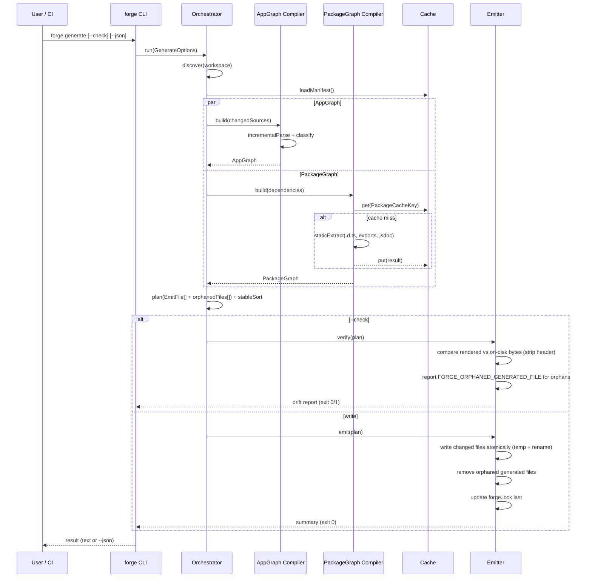
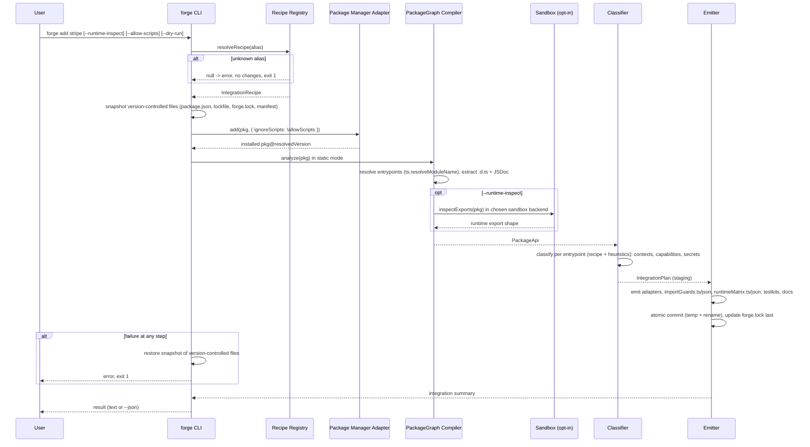

# Design Document: Forge Compiler & `forge add` Integration Layer (MVP)

## Overview

The **Forge Compiler** is the architectural core of ForgeOS: a TypeScript/Bun-based code generation engine that reads an application's sources (schema DSL, commands, queries, policies, `package.json` + lockfile, installed package `.d.ts` files, and JSDoc) and emits a **deterministic, content-hash-cached, source-controlled** `src/forge/_generated/` directory. It is conceptually analogous to Convex's `convex/_generated` codegen pattern, but broader in scope.

This MVP spec covers a single vertical slice of ForgeOS: the compiler pipeline and the package-aware integration layer. It is built from three sub-compilers feeding one generation orchestrator:

1. **AppGraph Compiler** — combines **Tree-sitter** (structural parse, byte spans, Forge builder call-sites) with the **TypeScript Compiler API** (`Program` / `TypeChecker` for the import/export graph, module resolution, path aliases, type-only imports, alias symbols, and tsconfig awareness). It extracts symbols, builds a **ModuleGraph** for transitive import-guard analysis, classifies symbols into Forge semantic kinds (`schema.table`, `query`, `liveQuery`, `command`, `endpoint`, `policy`, `workflow`, `agent`, `telemetryEvent`, …), and emits `_generated/appGraph.{ts,json}`. Incremental work is **file-level**, keyed by content hash. (Concepts adapted from the Apache-2.0 project `Stahldavid/sensegrep`.)
2. **PackageGraph Compiler** — a "static-first" dependency/API oracle that resolves entrypoints with TypeScript's real module resolver (`ts.resolveModuleName`), parses `.d.ts` type signatures via the TypeScript Compiler API, and extracts JSDoc/README/examples **without executing package code**. Runtime export inspection is opt-in and sandboxed. Emits `_generated/packageGraph.{ts,json}`. (Concepts adapted from the MIT project `Stahldavid/deplens`, hardened for stronger static-vs-runtime separation and determinism.)
3. **`forge add <package>`** — installs a package (with lifecycle scripts disabled by default) via a package-manager adapter, runs the PackageGraph Compiler, classifies runtime compatibility per entrypoint export, detects required secrets and network egress, and generates typed adapters, import guards, a runtime matrix, testkits/mocks, and per-integration docs. Classification, capabilities, secrets, and generated files are driven by explicit, versioned **integration recipes** for the reference packages. The operation is transactional, and it maintains a semantic lockfile `forge.lock`.

Cross-cutting guarantees — **determinism & reproducibility** (committed output is *fully* deterministic; timestamps live only in runtime logs, never in committed artifacts), **security (no untrusted code execution in static mode; sandboxed runtime inspection; never index secrets)**, **performance (incremental, content-hash caching, parallel workers)**, and **reliability (committed + CI-verified generated output)** — are first-class design concerns reflected throughout.

> **Note on the AppGraph's role:** The AppGraph is *internal compiler infrastructure* used for codegen, impact analysis, and quality gates. It is **not** a search tool for an AI agent. The AI agent keeps its own harness (sensegrep / deplens / MCP) entirely separate from this compiler.

---

## Scope

### In Scope (MVP)

- `forge generate` deterministic codegen into `src/forge/_generated/`, with `--check` CI verification mode.
- AppGraph Compiler (Tree-sitter structural parse + TypeScript Compiler API import/export graph, file-level incremental parse keyed by content hash, ModuleGraph for transitive guards, symbol extraction, semantic classification, duplicate-detection warning gate).
- PackageGraph Compiler (static-first `.d.ts` + `exports` + JSDoc extraction via TypeScript's real module resolver; opt-in sandboxed runtime inspection).
- `forge add <package>` for the 5 reference packages: **stripe, posthog, sentry, zod, ai (Vercel AI SDK)**, driven by versioned integration recipes; transactional install/generate with lifecycle scripts disabled by default; package-manager adapter (bun/npm/pnpm/yarn).
- Generated typed adapters, import guards, runtime matrix, testkits/mocks, per-integration docs.
- Semantic lockfile `forge.lock`.
- Import-guard / runtime-matrix enforcement (MVP: ESLint plugin + `forge check`; path to TS language-service plugin later).
- CLI surface: `forge generate`, `forge generate --check`, `forge add <package>`, `forge inspect app|packages|capabilities|runtime-matrix`, `forge check`. All support `--json`, `--dry-run`, and CI exit codes.

### Out of Scope (future specs — explicitly NOT designed here)

- Live queries over Postgres (the `liveQuery` runtime; only its *classification* exists in the AppGraph).
- Workflows / Temporal integration (only the `workflow` classification kind exists).
- TelemetryGraph (only the `telemetryEvent` classification kind exists).
- SourceDB.
- Multi-tenant cloud sandboxing (MVP sandbox is static-only by default; opt-in backends are a best-effort local child process or Docker).
- Optional embedding/semantic index via LanceDB (off by default; only the extension seam is noted).
- TS language-service plugin enforcement (MVP uses ESLint + `forge check`).
- True Tree-sitter incremental edit-range parsing and watch mode (MVP is file-level incremental; watch mode is reserved behind the same interface).
- Stronger isolation backends (nsjail / bubblewrap / gVisor / Firecracker / workerd / Wasmtime) — noted as future paths only.

---

## Architecture

```mermaid
graph TD
    subgraph CLI["forge CLI (Bun, Node fallback)"]
        GEN[forge generate / --check]
        ADD[forge add &lt;package&gt;]
        INS[forge inspect]
        CHK[forge check]
    end

    subgraph Core["Compiler Core"]
        ORCH[Generation Orchestrator]
        APP[AppGraph Compiler<br/>Tree-sitter + TS Compiler API]
        PKG[PackageGraph Compiler]
        CLASS[Runtime-Context Classifier]
        RECIPE[Integration Recipe Registry]
        EMIT[Deterministic Emitter]
        CACHE[(Content-Hash Cache)]
        PM[Package Manager Adapter<br/>bun/npm/pnpm/yarn]
    end

    subgraph Inputs["Project Inputs"]
        SRC[src/**/*.ts,tsx<br/>schema DSL, commands,<br/>queries, policies]
        PJSON[package.json + lockfile<br/>+ tsconfig]
        DTS[node_modules/**/*.d.ts<br/>exports / JSDoc / README]
    end

    subgraph Sandbox["Optional Runtime Inspection (opt-in)"]
        SBX[sandboxBackend: none | child | docker<br/>recommended: docker --network none --read-only]
    end

    subgraph Output["src/forge/_generated/ (committed)"]
        OUT[appGraph · packageGraph<br/>packages/* · importGuards.ts/json<br/>runtimeMatrix.ts/json · testkits · docs]
        LOCK[forge.lock]
    end

    GEN --> ORCH
    ADD --> ORCH
    ADD --> PM
    INS --> ORCH
    CHK --> CLASS

    SRC --> APP
    PJSON --> PKG
    DTS --> PKG
    RECIPE --> CLASS
    PKG -. opt-in .-> SBX
    SBX --> PKG

    APP --> ORCH
    PKG --> CLASS
    CLASS --> ORCH
    ORCH <--> CACHE
    ORCH --> EMIT
    EMIT --> OUT
    EMIT --> LOCK
```

### Pipeline Phases

1. **Discover** — resolve workspace root, source globs, `package.json`, lockfile, tsconfig; detect the package manager; compute input fingerprints.
2. **Parse (AppGraph)** — file-level incremental Tree-sitter parse of changed files (keyed by content hash) for structure/spans/call-sites, combined with TypeScript Compiler API for the import/export graph and module resolution; build the ModuleGraph; extract + classify symbols.
3. **Analyze (PackageGraph)** — for each dependency, static-first `.d.ts`/`exports`/JSDoc extraction (cached by a rich per-package key; see Cache Key); optional sandboxed runtime inspection.
4. **Classify** — assign runtime contexts and capabilities (network / filesystem / process / secrets) per package entrypoint export, driven by integration recipes plus heuristics.
5. **Plan** — orchestrator builds an ordered, stably-sorted set of `EmitFile` plans plus the set of orphaned generated files; diff against actual on-disk bytes.
6. **Emit** — deterministic emitter writes files atomically (temp file + rename), removes orphaned generated files (or reports them in check mode), and updates `forge.lock` last.
7. **Verify** — quality gates (duplicate detection, transitive guard violations, orphan detection) report warnings/errors with CI exit codes.

---

## Sequence Diagrams

### `forge generate`



### `forge add <package>`



---

## Generated Directory Layout

All paths are committed to source control and verified in CI via `forge generate --check`.

```
src/forge/_generated/
├── appGraph.ts              # typed AppGraph export (symbols, kinds, edges)
├── appGraph.json            # machine-readable AppGraph snapshot
├── packageGraph.ts          # typed PackageGraph export
├── packageGraph.json        # machine-readable PackageGraph snapshot
├── runtimeMatrix.ts         # package × entrypoint × runtime-context matrix (typed, for DX)
├── runtimeMatrix.json       # machine-readable matrix (consumed by ESLint plugin / CI)
├── importGuards.ts          # guard rules (typed, for DX)
├── importGuards.json        # guard rules consumed by ESLint plugin / forge check
├── packages/
│   ├── stripe.server.ts     # typed adapter, runtime-scoped
│   ├── stripe.command.ts    # (omitted if incompatible; see runtimeMatrix)
│   ├── posthog.client.ts
│   ├── posthog.server.ts
│   ├── sentry.server.ts
│   ├── zod.shared.ts
│   └── ai.server.ts
├── testkits/
│   ├── stripe.mock.ts
│   └── ...
├── docs/
│   ├── stripe.md
│   └── ...
└── index.ts                 # barrel re-export (stably sorted)

forge.lock                   # semantic lockfile (repo root)
.forge/cache/                # content-hash cache (git-ignored)
```

---

## Components and Interfaces

### Component 1: Generation Orchestrator

**Purpose**: Coordinates the full pipeline (discover → parse → analyze → classify → plan → emit → verify), owns the cache manifest, and enforces deterministic ordering.

**Interface**:
```typescript
interface GenerationOrchestrator {
  run(options: GenerateOptions): Promise<GenerateResult>;
  plan(app: AppGraph, pkg: PackageGraph): EmitPlan;
}

interface GenerateOptions {
  workspaceRoot: string;
  check: boolean;        // CI verification mode (no writes)
  dryRun: boolean;       // print intended changes, no writes
  json: boolean;         // machine-readable output
  concurrency: number;   // parallel worker count
}

interface GenerateResult {
  changed: string[];     // file paths written (or that would change in --check)
  unchanged: string[];
  warnings: Diagnostic[];
  errors: Diagnostic[];
  exitCode: 0 | 1;
}
```

**Responsibilities**:
- Resolve workspace, compute input fingerprints, schedule parallel workers.
- Merge sub-compiler outputs into a single stably-ordered `EmitPlan`.
- Drive emit vs. verify paths; aggregate diagnostics; set CI exit codes.

### Component 2: AppGraph Compiler

**Purpose**: Build the classified AppGraph and ModuleGraph from the project's own sources, using **both** Tree-sitter (structural parse, byte spans, Forge builder call-sites) **and** the TypeScript Compiler API (`Program` / `TypeChecker` for the import/export graph, module resolution, path aliases, type-only imports, alias symbols, and tsconfig awareness). MVP incremental work is **file-level**, keyed by content hash.

**Interface**:
```typescript
interface AppGraphCompiler {
  build(sources: SourceFile[], prior?: AppGraph): Promise<AppGraph>;
  buildModuleGraph(sources: SourceFile[], program: ts.Program): ModuleGraph;
  classify(symbol: RawSymbol): ForgeKind | null;
}

interface SourceFile {
  path: string;
  contentHash: string;   // sha256 of UTF-8 bytes
  text: string;
}
```

**Responsibilities**:
- **File-level incremental caching**: reparse a whole file iff its `contentHash` changed; otherwise reuse prior symbols for that file. (True Tree-sitter incremental edit-range parsing is reserved for a future watch mode, behind this same interface.)
- Use Tree-sitter for declaration structure, byte spans, and Forge builder API call-sites (e.g. `defineTable`, `query`, `command`); use the TypeScript Compiler API for the module import/export graph, module resolution, path aliases, type-only imports, and alias symbols (tsconfig-aware).
- Build a `ModuleGraph` linking modules by their local imports and per-entrypoint runtime contexts, enabling **transitive** import-guard analysis.
- Classify each symbol into a `ForgeKind`; run duplicate-detection (warning gate).

**Watcher principle**: one watcher per workspace with a shared index/cache; never spawn duplicate watchers or parallel agents that each re-index the same tree (informed by sensegrep's parallel-agent guidance). Watch mode itself is out of scope for the MVP, but the single-watcher/shared-cache contract is fixed now.

### Component 3: PackageGraph Compiler

**Purpose**: Static-first dependency/API oracle. Resolves entrypoints, parses `.d.ts`, extracts JSDoc/README/examples. Optional sandboxed runtime inspection.

**Interface**:
```typescript
interface PackageGraphCompiler {
  build(deps: Dependency[], opts: AnalyzeOptions): Promise<PackageGraph>;
  analyze(dep: Dependency, opts: AnalyzeOptions): Promise<PackageApi>;
}

interface AnalyzeOptions {
  runtimeInspect: boolean;        // opt-in; requires sandbox
  resolutionMode: "nodenext" | "bundler";
  cacheDir: string;
}

interface Dependency {
  name: string;
  version: string;
  packageManager: "bun" | "npm" | "pnpm" | "yarn";
  packageIntegrity?: string;      // lockfile integrity hash, when available
  installPath: string;            // node_modules/<name>
}
```

**Responsibilities**:
- Resolve entrypoints using TypeScript's real module resolver (`ts.resolveModuleName` with `resolvePackageJsonExports`/`resolvePackageJsonImports`, `customConditions` including `"types"`) in **both** NodeNext and Bundler modes — not a hand-rolled `exports.types` reader.
- Preserve the semantic **order** of `exports` conditions during resolution (only the emitted output is sorted; the resolution object is never reordered).
- Support explicit subpath exports in the MVP; mark pattern exports (`./foo/*`) as pattern-backed and expand them only when the package file list is available and below a configured limit.
- Parse `.d.ts` via TypeScript Compiler API → `ExportSignature[]`, handling overloads (multiple signatures per export).
- Extract JSDoc tags, README snippets, usage examples.
- Cache by a rich per-package key (see Cache Key); fall back to `@types/*` packages when a dependency ships no bundled types; never execute package code in static mode.
- When `runtimeInspect` is on, delegate to the Sandbox component only.

### Component 4: Runtime-Context Classifier

**Purpose**: Maps each package entrypoint export to compatible Forge runtime contexts and detects capabilities (network / filesystem / process / native addon / lifecycle scripts / secrets), driven by integration recipes plus heuristics.

**Interface**:
```typescript
interface RuntimeClassifier {
  classify(api: PackageApi, recipe?: IntegrationRecipe): RuntimeClassification;
  detectCapabilities(api: PackageApi, recipe?: IntegrationRecipe): CapabilitySet;
  detectSecrets(api: PackageApi, recipe?: IntegrationRecipe): SecretRequirement[];
}
```

**Responsibilities**:
- Prefer explicit recipe classification for reference packages; otherwise apply heuristic + rule-based classification (signals: Node built-in imports, `fetch`/network types, `process.env` access, known package rules).
- Classify at **per integration-alias → package → entrypoint → export** granularity, not whole-package.
- Use the tri-state evidence capability model: `unknown` capabilities are treated as **incompatible** for deterministic contexts (`command`/`query`/`liveQuery`), since static analysis cannot prove the *absence* of network/filesystem access.
- Produce the per-entrypoint compatibility matrix used to gate imports and to decide which adapter variants to emit.

### Component 5: Deterministic Emitter

**Purpose**: Renders `EmitPlan` to bytes deterministically; writes changed files only; updates `forge.lock`; supports `--check` and `--dry-run`.

**Interface**:
```typescript
interface DeterministicEmitter {
  emit(plan: EmitPlan, mode: EmitMode): Promise<EmitOutcome>;
  render(file: EmitFile): string;     // pure: same input → same bytes
}

type EmitMode = "write" | "check" | "dry-run";
```

**Responsibilities**:
- Render with stable key ordering, fixed formatting, normalized newlines (`\n`), trailing newline.
- Prefix every file with a **deterministic** header: generator version + input-hash + file-hash. **No timestamp** appears in committed output.
- **Atomic writes**: render to a temp file in the same directory, then atomically rename into place; update `forge.lock` last.
- **Orphan cleanup**: in `write` mode, remove `orphanedFiles` within `src/forge/_generated/`; in `check` mode, report each as `FORGE_ORPHANED_GENERATED_FILE`.
- In `check` mode, compare each planned file's rendered bytes to its **actual on-disk bytes** (after stripping the volatile header), not merely to a cache manifest entry. The cache manifest is an optimization, never the source of truth for drift detection.

### Component 6: Sandbox (Runtime Inspection)

**Purpose**: Execute opt-in runtime export inspection in isolation. **MVP default is static-only (`sandboxBackend: "none"`) — no runtime inspection at all.**

**Interface**:
```typescript
interface Sandbox {
  inspectExports(dep: Dependency, limits: SandboxLimits): Promise<RuntimeExportShape>;
}

type SandboxBackend = "none" | "child" | "docker";

interface SandboxLimits {
  backend: SandboxBackend;
  timeoutMs: number;
  memoryMb: number;
  network: false;          // requested; only enforceable under docker
  filesystem: "read-only"; // requested; only enforceable under docker
  allowPostinstall: false; // always disabled
}
```

**Responsibilities (MVP)**:
- `"none"` (default): perform no runtime inspection; rely entirely on static analysis.
- `"child"` (best-effort): spawn a restricted child process with a timeout and a scrubbed env. This is **explicitly NOT a security boundary** for untrusted packages — it cannot portably guarantee no-network, read-only filesystem, or memory caps, and `node:vm` is **not** a security mechanism. Use only for trusted, already-installed packages.
- `"docker"` (recommended for real runtime inspection): run `docker run --network none --read-only --memory 256m --pids-limit <n> --cap-drop ALL` with a scrubbed environment.
- Return only a serializable export shape; never surface package process state to the parent.
- Run the secret-leak scan on serialized inspection results (see Security Considerations).
- Future stronger backends behind this same interface: **nsjail/bubblewrap** (Linux local), **gVisor/Firecracker** (cloud multi-tenant), **workerd/Wasmtime**.

### Component 7: CLI

**Purpose**: User/CI entrypoint; argument parsing; output formatting; exit codes.

**Interface**:
```typescript
interface ForgeCli {
  generate(opts: GenerateOptions): Promise<number>;       // exit code
  add(pkg: string, opts: AddOptions): Promise<number>;
  inspect(target: InspectTarget, opts: CliCommonOptions): Promise<number>;
  check(opts: CliCommonOptions): Promise<number>;
}

type InspectTarget = "app" | "packages" | "capabilities" | "runtime-matrix";

interface CliCommonOptions { json: boolean; dryRun: boolean; }
interface AddOptions extends CliCommonOptions {
  runtimeInspect: boolean;
  sandboxBackend: "none" | "child" | "docker";
  allowScripts: boolean;          // enable package lifecycle scripts (default false)
}
```

### Component 8: Integration Recipe Registry

**Purpose**: Provide explicit, versioned **recipes** for the reference packages so that classification, capabilities, secrets, and generated files come from curated knowledge rather than pure heuristics. Heuristics remain the fallback for non-reference packages.

**Interface**:
```typescript
interface IntegrationRecipeRegistry {
  resolveRecipe(alias: string): IntegrationRecipe | null;
  supports(alias: string): boolean;
  list(): IntegrationRecipe[];
}
```

**Responsibilities**:
- Map an integration alias to one or more real npm packages, the supported version range, allowed/denied contexts, capabilities, secrets, adapters, testkits, docs, and optional import rewrites.
- Version each recipe (`recipeVersion`) so cache keys and lockfile entries can track recipe changes.
- Drive `forge add` for the 5 reference packages (see Data Models → IntegrationRecipe for the alias→package map).

### Component 9: Package Manager Adapter

**Purpose**: Abstract over `bun` / `npm` / `pnpm` / `yarn` for installs, dry-run installs, and resolved-version detection. Lifecycle scripts are disabled by default.

**Interface**:
```typescript
interface PackageManagerAdapter {
  name: "bun" | "npm" | "pnpm" | "yarn";
  add(spec: string, opts: PmAddOptions): Promise<PmAddResult>;
  dryRunAdd(spec: string, opts: PmAddOptions): Promise<PmAddResult>;   // install into temp dir/cache
  detectResolvedVersion(spec: string): Promise<string>;
}

interface PmAddOptions {
  ignoreScripts: boolean;   // default true: disable lifecycle/postinstall scripts
  cwd: string;
}

interface PmAddResult {
  resolvedVersion: string;
  integrity?: string;
  lockfileChanged: boolean;
}
```

**Responsibilities**:
- Detect the active package manager via the `packageManager` field / lockfile presence.
- Install with lifecycle/postinstall scripts **disabled by default** (e.g. `--ignore-scripts` where supported). Note: Bun blocks arbitrary lifecycle scripts unless the package is listed in `trustedDependencies`. Enabling scripts requires explicit `--allow-scripts`.
- `dryRunAdd` installs into a temp dir/cache with scripts blocked and analyzes there without modifying the workspace. Simpler fallback: report the recipe-known plan and note that `.d.ts` analysis requires a real install.

---

## Data Models

### AppGraph

```typescript
type ForgeKind =
  | "schema.table"
  | "query"
  | "liveQuery"
  | "command"
  | "endpoint"
  | "policy"
  | "workflow"
  | "agent"
  | "telemetryEvent";

interface AppGraph {
  schemaVersion: string;      // schema version of this model
  generatorVersion: string;   // version of the generator that produced this graph
  analyzerVersion: string;    // version of the AppGraph analyzer
  inputHash: string;          // hash of all inputs that produced this graph
  symbols: ForgeSymbol[];     // stably sorted by (kind, name, file, span.start)
  edges: ForgeEdge[];         // references between symbols
  moduleGraph: ModuleGraph;   // local module import graph with context propagation
  diagnostics: Diagnostic[];
}

interface ForgeSymbol {
  id: string;                 // stable id = hash(kind + qualifiedName)
  kind: ForgeKind;
  name: string;
  qualifiedName: string;
  file: string;               // workspace-relative, posix separators
  span: { start: number; end: number };
  contentHash: string;        // hash of the symbol's source slice
  meta: Record<string, JsonValue>;
}

interface ForgeEdge {
  from: string;               // ForgeSymbol.id
  to: string;                 // ForgeSymbol.id
  kind: "references" | "registers" | "guards" | "emits";
}

interface ModuleGraph {
  nodes: ModuleNode[];        // sorted by id
}

interface ModuleNode {
  id: string;
  file: string;                          // workspace-relative, posix separators
  directPackageImports: PackageImport[];
  localImports: LocalImport[];           // edges to other ModuleNode ids
  declaredContexts: RuntimeContext[];    // contexts declared at this module (e.g. entrypoint kind)
  effectiveContexts: RuntimeContext[];   // declared + propagated from importers
}

interface PackageImport {
  specifier: string;                     // raw import specifier
  packageName: string;
  subpath: string;
  span: { start: number; end: number };
  importKind: "static" | "dynamic" | "require";
}

interface LocalImport {
  toModuleId: string;
  span: { start: number; end: number };
}
```

**Validation Rules**:
- `id` MUST be unique; collisions are a duplicate-detection warning, not a hard error.
- `file` MUST be workspace-relative and use `/` separators (cross-platform determinism).
- `symbols`, `edges`, and `moduleGraph.nodes` MUST be stably sorted before emission.
- `inputHash`, `generatorVersion`, and `analyzerVersion` are deterministic for a given input set; the model contains **no timestamp**.
- `effectiveContexts` MUST include every context propagated from any importing entrypoint (transitive closure over `localImports`).

### PackageGraph

```typescript
interface PackageGraph {
  schemaVersion: string;
  generatorVersion: string;
  analyzerVersion: string;
  packages: PackageApi[];     // sorted by name
}

interface PackageApi {
  name: string;
  version: string;
  packageManager: "bun" | "npm" | "pnpm" | "yarn";
  resolutionMode: "nodenext" | "bundler";
  entrypoints: Entrypoint[];  // resolved from exports field, semantic condition order preserved internally
  source: "static" | "static+runtime";
  contentChecksum: string;    // cache key component (no timestamps)
}

interface Entrypoint {
  subpath: string;            // e.g. ".", "./server"
  conditions: string[];       // e.g. ["import","types","node"] — semantic order preserved
  patternBacked: boolean;     // true if expanded from a pattern export (./foo/*)
  dtsPath: string | null;
  exports: ExportSignature[];
}

interface ExportSignature {
  name: string;
  kind: "function" | "class" | "const" | "type" | "interface" | "namespace";
  signature: string;          // deterministic, stable normalized display string (best-effort)
  overloads?: string[];       // additional signatures when the export has TypeScript overloads
  declarations?: string[];    // normalized text of multiple declarations, when applicable
  classification: ExportClassification;
  jsdoc: JsDoc | null;
  examples: string[];
}

interface ExportClassification {
  alias: string;              // integration alias this export belongs to
  packageName: string;
  entrypoint: string;         // subpath
  exportName: string;
  compatible: RuntimeContext[];
  incompatible: RuntimeContext[];
  capabilities: CapabilitySet;
}

interface JsDoc {
  summary: string;
  tags: { tag: string; text: string }[];
}
```

**Validation Rules**:
- `packages` sorted by `name`; `entrypoints` by `subpath`; `exports` by `name`. The semantic order of `conditions` is preserved internally for resolution and only the *emitted* output is sorted.
- `contentChecksum` MUST be derived only from static inputs (and runtime shape when `source === "static+runtime"`), never from timestamps.
- `signature` is a deterministic, stable normalized **display** string produced by the TypeChecker plus a normalized printer with best-effort safe alias expansion. The MVP does **not** claim full semantic structural equivalence for all TypeScript types — two textually-equal normalized strings are treated as equal; deeper structural equality is out of scope.

### Runtime Classification & forge.lock

```typescript
type RuntimeContext =
  | "shared" | "client" | "server" | "query" | "liveQuery"
  | "command" | "action" | "workflow" | "endpoint" | "edge"
  | "test" | "build";

// Context semantics:
//   - `shared`  : safe in any context (pure code, e.g. zod schemas)
//   - `server`  : server-only module NOT bound to a deterministic runtime
//   - `query` / `command` / `liveQuery` : narrower, deterministic server contexts
//   - "narrower context wins": a module reachable from both `server` and `command`
//     must satisfy the narrower `command` constraints.

type CapabilityStatus = "required" | "not-detected" | "unknown" | "forbidden";

interface Capability<T = unknown> {
  status: CapabilityStatus;
  confidence: "manual" | "rule" | "static" | "runtime";
  evidence: string[];               // human-readable signals (no secret values)
  value?: T;
}

interface CapabilitySet {
  network: Capability<{ egress?: string[] }>;
  filesystem: Capability<{ read?: boolean; write?: boolean }>;
  process: Capability;
  nativeAddon: Capability;
  lifecycleScripts: Capability;
  secrets: SecretRequirement[];
}
// Rule: a capability with status `unknown` MUST be treated as INCOMPATIBLE for the
// deterministic contexts (command/query/liveQuery). Static analysis cannot prove the
// ABSENCE of network/filesystem access, so `not-detected` (known absent) and `unknown`
// (undetermined) are deliberately distinct.

interface RuntimeClassification {
  // Per-package summary; per-entrypoint detail lives in ExportClassification / runtimeMatrix.
  compatible: RuntimeContext[];
  incompatible: RuntimeContext[];
  rationale: Record<RuntimeContext, string>;
  perEntrypoint: ExportClassification[];   // per integration-alias → package → entrypoint → export
}

interface SecretRequirement {
  envVar: string;             // e.g. "STRIPE_SECRET_KEY" — NAME only, never a value
  required: boolean;
  detectedFrom: "jsdoc" | "signature" | "rule" | "readme" | "recipe";
}

interface PackageCacheKey {
  name: string;
  version: string;
  packageManager: "bun" | "npm" | "pnpm" | "yarn";
  packageIntegrity?: string;
  packageJsonHash: string;
  dtsFilesHash: string;
  analyzerVersion: string;
  typescriptVersion: string;
  resolutionMode: "nodenext" | "bundler";
  recipeVersion?: string;
}

interface ForgeLock {
  schemaVersion: string;
  generatorVersion: string;   // generator version
  analyzerVersion: string;
  inputHash: string;          // deterministic fingerprint of all inputs
  lockfileHash: string;       // global lockfile hash (informational; does NOT force whole-graph invalidation)
  packages: ForgeLockEntry[]; // sorted by name
}

interface ForgeLockEntry {
  name: string;
  version: string;
  recipeVersion?: string;
  // forge.lock summarizes capabilities/contexts at PACKAGE level; the per-entrypoint
  // detail is carried by runtimeMatrix.
  runtimeContexts: RuntimeContext[];
  capabilities: CapabilitySet;
  secrets: SecretRequirement[];
  generatedFiles: string[];   // stably sorted, workspace-relative
  contentChecksum: string;
}
```

**Validation Rules**:
- `forge.lock` MUST be deterministically serialized (sorted keys, sorted arrays, `\n` newlines).
- `forge.lock` MUST contain **no timestamp**; reproducibility relies on `inputHash`/`generatorVersion`/`analyzerVersion`.
- Every `generatedFiles` path MUST exist after a successful `forge add` / `forge generate`.
- `lockfileHash` is informational and MUST NOT, by itself, force invalidation of the whole package graph; per-package invalidation uses `PackageCacheKey`.

### Integration Recipe

```typescript
interface IntegrationRecipe {
  alias: string;                       // e.g. "stripe"
  packages: PackageRecipe[];
  supportedVersionRange: string;       // semver range
  recipeVersion: string;
  contexts: { allowed: RuntimeContext[]; denied: RuntimeContext[] };
  capabilities: CapabilitySet;
  secrets: SecretRequirement[];        // env-var NAMES only
  adapters: string[];                  // adapter file basenames to emit
  testkits: string[];
  docs: string[];
  importRewrites?: { from: string; to: string }[];
}

interface PackageRecipe {
  packageName: string;                 // real npm package
  role?: string;                       // e.g. "client" | "server" | "provider"
  supportedVersionRange?: string;
}
```

**Reference package recipes (alias → real npm packages):**

| Alias | npm package(s) | Allowed contexts | Secrets (names) | Network / notes |
|-------|----------------|------------------|-----------------|-----------------|
| `stripe` | `stripe` | server, action, workflow, endpoint | `STRIPE_SECRET_KEY`, `STRIPE_WEBHOOK_SECRET` | `api.stripe.com`; webhook helper needs the raw request body |
| `posthog` | `posthog-js` (client), `posthog-node` (server) | client (posthog-js), server/action/workflow/endpoint (posthog-node) | `NEXT_PUBLIC_POSTHOG_KEY` / `POSTHOG_KEY`, `POSTHOG_HOST` (config) | server-side flag eval attaches evaluated flags to captured events |
| `sentry` | framework-dependent: `@sentry/nextjs` **or** `@sentry/node` + `@sentry/browser` | client + server (per package) | `SENTRY_DSN`, `SENTRY_AUTH_TOKEN`, `SENTRY_ORG`, `SENTRY_PROJECT` | source-map upload flow |
| `zod` | `zod` | **all** contexts incl. `shared` | none | no network / no secrets — the "pure package" reference |
| `ai` | `ai` | server, action, workflow, endpoint | (provider packages classified separately) | provider packages: `@ai-sdk/openai` → `OPENAI_API_KEY`, `@ai-sdk/anthropic` → `ANTHROPIC_API_KEY` |

> Provider packages for `ai` (`@ai-sdk/openai`, `@ai-sdk/anthropic`, …) are classified **separately** with their own secrets and capabilities, not folded into the `ai` core recipe.

### EmitPlan (internal)

```typescript
interface EmitPlan {
  files: EmitFile[];          // stably sorted by path
  orphanedFiles: string[];    // previously-generated files no longer planned (within _generated/)
  lock: ForgeLock;
}

interface EmitFile {
  path: string;               // workspace-relative
  content: string;            // fully rendered bytes (post-format)
  contentHash: string;        // sha256(content without volatile header fields)
}
```

### Diagnostics

```typescript
interface Diagnostic {
  severity: "error" | "warning" | "info";
  code: string;               // e.g. "FORGE_DUP_SYMBOL", "FORGE_GUARD_VIOLATION", "FORGE_ORPHANED_GENERATED_FILE", "FORGE_SECRET_LEAK", "FORGE_PKG_NO_TYPES"
  message: string;
  file?: string;
  span?: { start: number; end: number };
}
```

---

## Key Functions with Formal Specifications

### `runGenerate()`

```typescript
function runGenerate(options: GenerateOptions): Promise<GenerateResult>
```

**Preconditions:**
- `options.workspaceRoot` exists and contains a readable `package.json`.
- `options.concurrency >= 1`.

**Postconditions:**
- In `write` mode: on-disk `_generated/` and `forge.lock` are byte-identical to the rendered `EmitPlan`.
- In `check` mode: no files are written; `exitCode === 1` iff any rendered file differs from disk OR any error diagnostic exists.
- `result.changed ∪ result.unchanged` equals the full set of planned files.
- The function is **idempotent**: running twice with unchanged inputs produces `result.changed === []` on the second run.

**Loop Invariants:**
- While iterating planned files, every already-processed file has been either written-if-changed or recorded as unchanged, and the cache manifest reflects every processed file's hash.

### `incrementalParse()`

```typescript
function incrementalParse(sources: SourceFile[], prior?: AppGraph): Promise<RawSymbol[]>
```

**Preconditions:**
- Each `source.contentHash` equals `sha256(source.text)`.

**Postconditions:**
- A file is reparsed iff its `contentHash` is absent from `prior` or differs from the prior hash.
- The returned symbol set is independent of source ordering (set equality), and stable per content.

**Loop Invariants:**
- For every file processed so far, its symbols originate either from a fresh parse (hash changed) or from reused prior symbols (hash unchanged), never both.

### `extractDtsSignatures()`

```typescript
function extractDtsSignatures(dtsPath: string): ExportSignature[]
```

**Preconditions:**
- `dtsPath` is a readable `.d.ts` file.
- No package code is executed (static-only guarantee).

**Postconditions:**
- Returns one `ExportSignature` per exported declaration reachable from the entrypoint, with `overloads`/`declarations` populated when the export has multiple TypeScript signatures.
- `signature` is a deterministic, stable normalized **display** string (best-effort safe alias expansion); identical normalized strings are treated as equal. Full semantic structural equivalence is NOT claimed in the MVP.
- Function has no side effects beyond reading files.

**Loop Invariants:**
- All previously visited export declarations have a normalized signature and resolved JSDoc; the visited set never includes non-exported internals.

### `classifyRuntimeContext()`

```typescript
function classifyRuntimeContext(api: PackageApi, recipe?: IntegrationRecipe): RuntimeClassification
```

**Preconditions:**
- `api` is fully populated (entrypoints + exports resolved).

**Postconditions:**
- For each entrypoint export, `compatible` and `incompatible` partition the full `RuntimeContext` universe (disjoint, union = all contexts).
- Every context in either set has a `rationale` entry; `perEntrypoint` carries per integration-alias → package → entrypoint → export detail.
- A capability with status `unknown` forces the deterministic contexts (`command`/`query`/`liveQuery`) into `incompatible`.
- When a `recipe` is supplied, its `allowed`/`denied` contexts take precedence over heuristics.
- Deterministic: same `api` (+ `recipe`) → same classification.

**Loop Invariants:**
- For each runtime context evaluated, it has been placed in exactly one of `compatible` / `incompatible` with a recorded rationale.

### `checkImportGuards()`

```typescript
function checkImportGuards(moduleGraph: ModuleGraph, matrix: RuntimeMatrix): Diagnostic[]
```

**Preconditions:**
- `matrix` is the emitted runtime matrix; `moduleGraph` reflects current sources with `effectiveContexts` propagated from every Forge entrypoint.

**Postconditions:**
- For each module, every `directPackageImport` is checked against **all** of that module's `effectiveContexts` (transitive, not just imports inside a Forge entrypoint file).
- Returns one `error` diagnostic per (package import, violating effective context) pair where the context is in the package's incompatible set.
- A helper reachable from multiple contexts must satisfy **every** effective context.
- Returns `[]` iff all package imports are compatible with all effective contexts of the modules reaching them.

**Loop Invariants:**
- Every (module, package import, effective context) triple examined so far has been checked against the matrix and, if violating, recorded exactly once.

---

## Algorithmic Pseudocode

### Deterministic Codegen (orchestrator core)

```typescript
// Deterministic generation: same inputs -> byte-identical outputs.
async function runGenerate(options: GenerateOptions): Promise<GenerateResult> {
  const ctx = discover(options.workspaceRoot);            // sources, package.json, lockfile
  const manifest = await cache.loadManifest(options);

  // Parallel sub-compilers (independent inputs)
  const [appGraph, packageGraph] = await Promise.all([
    appCompiler.build(ctx.changedSources, manifest.priorAppGraph),
    pkgCompiler.build(ctx.dependencies, { cacheDir: ctx.cacheDir, runtimeInspect: false }),
  ]);

  const classifications = packageGraph.packages.map(p => classifier.classify(p));
  const plan = orchestrator.plan(appGraph, packageGraph, classifications);

  // CRITICAL: stable ordering before any rendering
  plan.files.sort((a, b) => compareAscii(a.path, b.path));

  const changed: string[] = [];
  const unchanged: string[] = [];

  for (const file of plan.files) {                        // INVARIANT: processed files accounted for
    const rendered = emitter.render(file);                // pure render (deterministic header, no timestamp)
    // Drift is decided against ACTUAL on-disk bytes (header stripped), not the manifest.
    const onDisk = existsOnDisk(file.path) ? stripHeader(readFile(file.path)) : null;
    const renderedBody = stripHeader(rendered);

    if (onDisk !== null && renderedBody === onDisk) {
      unchanged.push(file.path);
      manifest.fileHashes[file.path] = hashStable(renderedBody);   // manifest is an optimization only
      continue;
    }
    changed.push(file.path);
    if (options.check) continue;                          // check mode: detect only
    if (options.dryRun) continue;                         // dry-run: report only
    await writeFileAtomic(file.path, rendered);           // temp file in same dir + atomic rename
    manifest.fileHashes[file.path] = hashStable(renderedBody);
  }

  // Orphan handling: previously-generated files no longer planned.
  const orphanDiagnostics: Diagnostic[] = [];
  for (const orphan of plan.orphanedFiles) {              // within src/forge/_generated/ only
    if (options.check) {
      orphanDiagnostics.push({
        severity: "error", code: "FORGE_ORPHANED_GENERATED_FILE",
        message: `orphaned generated file: ${orphan}`, file: orphan,
      });
    } else if (!options.dryRun) {
      await removeFile(orphan);
    }
  }

  const diagnostics = [...qualityGates(appGraph, plan), ...orphanDiagnostics]; // dups, guards, orphans
  if (!options.check && !options.dryRun) {
    await writeForgeLock(plan.lock);                      // deterministic serialize; written LAST
    await cache.saveManifest(manifest);
  }

  const errors = diagnostics.filter(d => d.severity === "error");
  const driftFailure = options.check && (changed.length > 0 || orphanDiagnostics.length > 0);
  return {
    changed, unchanged,
    warnings: diagnostics.filter(d => d.severity === "warning"),
    errors,
    exitCode: (errors.length > 0 || driftFailure) ? 1 : 0,
  };
}
```

### `.d.ts` Signature Extraction (static-first)

```typescript
// Uses TypeScript Compiler API + real module resolver; never executes package code.
function resolveEntrypoint(pkgDir: string, subpath: string,
                           mode: "nodenext" | "bundler"): string | null {
  // Use TypeScript's real resolver, preserving semantic condition order.
  const res = ts.resolveModuleName(
    subpath === "." ? pkgName(pkgDir) : `${pkgName(pkgDir)}/${trim(subpath)}`,
    join(pkgDir, "package.json"),
    {
      moduleResolution: mode === "nodenext"
        ? ts.ModuleResolutionKind.NodeNext
        : ts.ModuleResolutionKind.Bundler,
      resolvePackageJsonExports: true,
      resolvePackageJsonImports: true,
      customConditions: ["types"],     // ordered; never reorder the resolution object
    },
    ts.sys,
  );
  return res.resolvedModule?.resolvedFileName ?? null;   // null -> FORGE_PKG_NO_TYPES; try @types/* fallback
}

function extractDtsSignatures(dtsPath: string): ExportSignature[] {
  const program = ts.createProgram([dtsPath], { noEmit: true, types: [] });
  const checker = program.getTypeChecker();
  const source = program.getSourceFile(dtsPath);
  ASSERT(source != null);

  const moduleSymbol = checker.getSymbolAtLocation(source);
  const exportsList = moduleSymbol ? checker.getExportsOfModule(moduleSymbol) : [];

  const results: ExportSignature[] = [];
  for (const sym of exportsList) {                        // INVARIANT: only exported symbols visited
    const decls = sym.declarations ?? [];
    if (decls.length === 0) continue;

    const type = checker.getTypeOfSymbolAtLocation(sym, decls[0]);
    // Handle overloads: a function symbol may expose multiple call signatures.
    const callSigs = type.getCallSignatures();
    const printed = callSigs.length > 0
      ? callSigs.map(s => normalizeSignature(checker, s))   // normalized display strings
      : [normalizeType(checker.typeToString(type))];

    results.push({
      name: sym.getName(),
      kind: classifyDeclKind(decls[0]),
      signature: printed[0],
      overloads: printed.length > 1 ? printed.slice(1) : undefined,
      declarations: decls.length > 1 ? decls.map(d => normalizeDecl(checker, d)) : undefined,
      classification: classifyExport(sym, dtsPath),       // per-entrypoint export classification
      jsdoc: extractJsDoc(sym, checker),
      examples: extractExamples(extractJsDoc(sym, checker)),
    });
  }
  // Determinism: only the EMITTED output is sorted by name.
  return results.sort((a, b) => compareAscii(a.name, b.name));
}
```

### Runtime-Context Classification

```typescript
const ALL_CONTEXTS: RuntimeContext[] =
  ["shared","client","server","query","liveQuery",
   "command","action","workflow","endpoint","edge","test","build"];
const DETERMINISTIC: RuntimeContext[] = ["command","query","liveQuery"];

function classifyRuntimeContext(api: PackageApi, recipe?: IntegrationRecipe): RuntimeClassification {
  const signals = gatherSignals(api);   // node-builtins, fetch/network types, process.env, rules
  const caps = detectCapabilities(api, recipe);   // tri-state CapabilitySet
  const perEntrypoint: ExportClassification[] = [];
  const compatible: RuntimeContext[] = [];
  const incompatible: RuntimeContext[] = [];
  const rationale: Record<string, string> = {};

  for (const cx of ALL_CONTEXTS) {       // INVARIANT: each context placed exactly once
    // Recipe allow/deny wins over heuristics.
    if (recipe?.contexts.denied.includes(cx)) {
      incompatible.push(cx); rationale[cx] = "denied by integration recipe"; continue;
    }
    // `unknown` capability => incompatible with deterministic contexts.
    if (DETERMINISTIC.includes(cx) && hasUnknownCapability(caps)) {
      incompatible.push(cx);
      rationale[cx] = "capability is `unknown`; cannot prove determinism (static analysis "
                    + "cannot prove ABSENCE of network/fs)";
      continue;
    }
    const verdict = recipe?.contexts.allowed.includes(cx)
      ? { ok: true, reason: "allowed by integration recipe" }
      : ruleEngine.evaluate(cx, signals, caps);   // deterministic rule eval
    (verdict.ok ? compatible : incompatible).push(cx);
    rationale[cx] = verdict.reason;     // e.g. "uses network; commands must be deterministic"
  }

  // Per integration-alias → package → entrypoint → export detail.
  for (const ep of api.entrypoints)
    for (const ex of ep.exports) perEntrypoint.push(ex.classification);

  return { compatible, incompatible,
           rationale: rationale as Record<RuntimeContext,string>, perEntrypoint };
}

// `server` = server-only module not bound to a deterministic runtime; query/command/liveQuery
// are narrower deterministic server contexts. When a module is reached from multiple contexts,
// the NARROWER context wins (it must satisfy every effective context).
```

### Import-Guard Checking (transitive, over the ModuleGraph)

```typescript
// Step 1: discover Forge entrypoints and seed their declared contexts.
// Step 2: propagate each entrypoint's RuntimeContext over the LOCAL module import graph.
// Step 3: for every reached module, check directPackageImports against ALL effectiveContexts.
function propagateContexts(mg: ModuleGraph): void {
  // Seed: each entrypoint module declares its context (command/query/liveQuery/action/
  // workflow/endpoint/client route, ...). Then BFS/DFS over localImports.
  const byId = index(mg.nodes, n => n.id);
  for (const entry of mg.nodes.filter(n => n.declaredContexts.length > 0)) {
    const stack = [...entry.localImports.map(l => l.toModuleId)];
    const seen = new Set<string>();
    // Propagate the entrypoint's declared contexts to everything it transitively imports.
    while (stack.length > 0) {
      const id = stack.pop()!; if (seen.has(id)) continue; seen.add(id);
      const node = byId.get(id); if (node == null) continue;
      node.effectiveContexts = union(node.effectiveContexts, entry.declaredContexts);
      for (const l of node.localImports) stack.push(l.toModuleId);
    }
  }
}

function checkImportGuards(moduleGraph: ModuleGraph, matrix: RuntimeMatrix): Diagnostic[] {
  const diagnostics: Diagnostic[] = [];
  propagateContexts(moduleGraph);

  for (const node of moduleGraph.nodes) {                // INVARIANT: every (module, import, ctx) checked once
    // A helper reachable from multiple contexts must satisfy EVERY effective context.
    for (const imp of node.directPackageImports) {
      const entry = matrix.lookup(imp.packageName);
      if (entry == null) continue;                       // unmanaged package: skip
      for (const context of node.effectiveContexts) {    // narrower context wins
        if (!entry.compatible.includes(context)) {
          diagnostics.push({
            severity: "error",
            code: "FORGE_GUARD_VIOLATION",
            message: `'${imp.packageName}' is not allowed in '${context}' context: `
                   + entry.rationale[context],
            file: node.file,
            span: imp.span,
          });
        }
      }
    }
  }
  return diagnostics;
}
```

### Sandboxed Runtime Inspection (opt-in; default backend is "none")

```typescript
async function inspectExports(dep: Dependency, limits: SandboxLimits): Promise<RuntimeExportShape> {
  ASSERT(limits.allowPostinstall === false);

  if (limits.backend === "none") {
    // MVP default: no runtime inspection at all; caller uses static result only.
    return RuntimeExportShape.empty();
  }

  let shape: RuntimeExportShape;
  if (limits.backend === "docker") {
    // RECOMMENDED real isolation for runtime inspection.
    shape = await runInDocker({
      image: INSPECTOR_IMAGE,
      args: ["run", "--network", "none", "--read-only",
             "--memory", `${limits.memoryMb}m`, "--pids-limit", "128",
             "--cap-drop", "ALL"],
      mountReadOnly: dep.installPath,
      env: scrubEnv(process.env),                        // strip secrets / .env values
      timeoutMs: limits.timeoutMs,
    });
  } else {
    // backend === "child": BEST-EFFORT only. NOT a security boundary for untrusted
    // packages — cannot portably guarantee no-network / ro-fs / mem caps; node:vm is
    // explicitly NOT a security mechanism. Use only for trusted packages.
    shape = await spawnRestrictedChild({
      entry: SANDBOX_INSPECTOR_ENTRY,
      argv: [dep.installPath],
      env: scrubEnv(process.env),
      timeoutMs: limits.timeoutMs,
      memoryMb: limits.memoryMb,
    }).result();
  }

  // Secret-leak scan on the SERIALIZED result: exact known secret values, secret-like
  // keys, high-entropy patterns, and known token prefixes (sk_/pk_/ghp_/xoxb-, ...).
  if (secretLeakScan(serialize(shape)).hasLeak) {
    emitError("FORGE_SECRET_LEAK");
    return RuntimeExportShape.empty();                   // withhold; fall back to static
  }
  return shape;
}
```

### Transactional `forge add`

```typescript
async function forgeAdd(alias: string, opts: AddOptions): Promise<number> {
  const recipe = recipeRegistry.resolveRecipe(alias);
  if (recipe == null) { emitError("unknown integration alias"); return 1; }   // no changes

  if (opts.dryRun) {
    // Install into a temp dir/cache with scripts blocked and analyze there,
    // OR (fallback) report the recipe-known plan and note that .d.ts analysis needs a real install.
    return reportDryRunPlan(recipe, opts);
  }

  const pm = detectPackageManager(opts);                 // packageManager field / lockfile
  const snapshot = snapshotVersionControlled([           // for rollback
    "package.json", pm.lockfile, "forge.lock", GENERATED_MANIFEST,
  ]);
  try {
    const installed = await pm.add(recipe.packages.map(p => p.packageName).join(" "),
                                   { ignoreScripts: !opts.allowScripts, cwd: workspaceRoot });
    const api = await pkgCompiler.analyze(toDependency(installed), { runtimeInspect: opts.runtimeInspect,
                                                                     resolutionMode, cacheDir });
    const plan = buildIntegrationPlan(api, recipe);       // staging
    await emitter.emit(plan, "write");                    // atomic commit; forge.lock last
    return 0;
  } catch (err) {
    restore(snapshot);                                    // roll back version-controlled files
    emitError(`forge add failed: ${err.message}`);
    return 1;
  }
}
```

---

## Example Usage

```typescript
// 1. Generate (local dev): write deterministic output
const result = await cli.generate({
  workspaceRoot: process.cwd(),
  check: false, dryRun: false, json: false, concurrency: 4,
});
process.exit(result.exitCode);

// 2. CI verification: fail if generated output is stale
//    $ forge generate --check --json
//    exitCode === 1 when on-disk _generated/ differs from a fresh render.

// 3. Add a package (static-first, runtime inspection off by default)
//    $ forge add stripe
//    -> emits packages/stripe.server.ts (NOT stripe.command.ts: incompatible)
//    -> updates importGuards.{ts,json}, runtimeMatrix.{ts,json}, testkits/stripe.mock.ts, docs/stripe.md
//    -> records forge.lock entry with secrets: ["STRIPE_SECRET_KEY","STRIPE_WEBHOOK_SECRET"]
//       and capabilities.network = { status: "required", confidence: "manual",
//                                    evidence: ["recipe:stripe"], value: { egress: ["api.stripe.com"] } }
//    -> transactional: on any failure, version-controlled files are restored

// 4. Add with opt-in runtime inspection (recommended backend: docker)
//    $ forge add ai --runtime-inspect --sandbox-backend docker

// 4b. Dry-run add: install into a temp dir with scripts disabled, analyze, no workspace changes
//    $ forge add ai --dry-run

// 5. Inspect
//    $ forge inspect runtime-matrix --json     # per-entrypoint detail
//    $ forge inspect capabilities

// 6. Enforce guards (e.g., importing stripe inside a command -> error)
//    $ forge check        # exit 1 on FORGE_GUARD_VIOLATION (incl. TRANSITIVE imports)
```

```typescript
// Illustration of a TRANSITIVE guard violation the design must catch:
// src/lib/payments.ts
import Stripe from "stripe";                 // network egress
export const client = new Stripe(process.env.STRIPE_SECRET_KEY!);

// src/commands/charge.ts
import { client } from "../lib/payments";    // ❌ FORGE_GUARD_VIOLATION (transitive)
export const charge = command(async (ctx, args) => {
  // 'stripe' is reached transitively from a `command` (deterministic) context.
  // The ModuleGraph propagates the `command` effective context to src/lib/payments.ts.
  // Correct placement: an `action` or `server` context.
});
```

---

## Correctness Properties

These properties are intended to be encoded as property-based tests (library: **fast-check**).

### Property 1: Determinism

∀ project state `S`, `render(plan(S)) === render(plan(S))` byte-for-byte across repeated runs and across machines, **including the file header** (generator version + input-hash + file-hash; no timestamp). Committed output is *fully* deterministic.

**Validates: Requirements 1.1, 1.3, 1.7**

### Property 2: Idempotency

∀ `S`, running `generate` twice with no input change ⟹ second run's `changed === []`.

**Validates: Requirements 1.4**

### Property 3: Check Equals Drift

`generate --check` returns `exitCode === 1` iff a subsequent `write` run would change at least one file, leave an orphaned generated file, or an error diagnostic exists. Drift is decided by comparing rendered bytes to **actual on-disk bytes** (header stripped), not a cache manifest entry.

**Validates: Requirements 1.6, 3.1, 3.6**

### Property 4: Stable Ordering

∀ permutations `P` of input source ordering, the emitted `appGraph`/`packageGraph` byte output is invariant (including the header, which carries no timestamp).

**Validates: Requirements 2.4, 2.5, 2.7**

### Property 5: Cache Soundness

∀ package `p`, if its `PackageCacheKey` (name, version, packageManager, packageIntegrity?, packageJsonHash, dtsFilesHash, analyzerVersion, typescriptVersion, resolutionMode, recipeVersion?) is unchanged, `analyze(p)` returns a result with identical `contentChecksum` (cache hit yields equal output to recompute). A changed global lockfile hash alone does NOT force whole-graph invalidation.

**Validates: Requirements 6.1, 6.2, 6.6**

### Property 6: Static Safety

∀ packages in static mode (`sandboxBackend: "none"`), no package code is executed (no `import()`/`require()` of dependency runtime).

**Validates: Requirements 5.2**

### Property 7: Transitive Guard Soundness

∀ module `m` reaching a Forge entrypoint context `c` (directly or transitively via the ModuleGraph), and ∀ direct package import `p` in `m`, `checkImportGuards` emits an error iff `c ∈ classify(p).incompatible`. A helper reachable from multiple contexts must satisfy **every** effective context.

**Validates: Requirements 9.1, 9.6**

### Property 8: Classification Totality & Unknown-Is-Incompatible

∀ entrypoint export, `compatible ∩ incompatible = ∅` and `compatible ∪ incompatible = RuntimeContext universe` (all 12 contexts). Additionally, any capability with status `unknown` ⟹ `command`, `query`, `liveQuery` ∈ `incompatible`.

**Validates: Requirements 7.1, 7.7**

### Property 9: Lock Integrity

∀ successful `add`/`generate`, every path in `forge.lock.generatedFiles` exists on disk; and after a transactional `forge add` failure, all snapshotted version-controlled files are restored unchanged.

**Validates: Requirements 8.6, 13.1**

### Property 10: Secret Exclusion

∀ emitted/cached artifacts, no `.env` value or detected secret value appears in output (only env-var *names* in `SecretRequirement`). The serialized-inspection secret-leak scan covers exact known secret values, secret-like keys, high-entropy patterns, and known token prefixes (`sk_`/`pk_`/`ghp_`/`xoxb-`, …).

**Validates: Requirements 12.1, 12.2, 12.3**

---

## Error Handling

### Scenario 1: Stale Generated Output in CI
**Condition**: `forge generate --check` finds drift between disk and a fresh render.
**Response**: Emit `FORGE_DRIFT` diagnostics listing changed files; exit code `1`.
**Recovery**: Developer runs `forge generate` locally and commits the result.

### Scenario 2: Unresolvable `exports` / Missing `.d.ts`
**Condition**: A subpath in `exports` cannot be resolved (via `ts.resolveModuleName`) or has no types, and no `@types/*` fallback exists.
**Response**: Warning `FORGE_PKG_NO_TYPES`; emit a best-effort adapter marked `untyped`; record in `forge.lock`.
**Recovery**: User may opt into `--runtime-inspect` or supply a manual override; generation does not hard-fail.

### Scenario 3: Sandbox Timeout / Memory Exceeded
**Condition**: Runtime inspection exceeds `timeoutMs` or `memoryMb` (only reachable when `sandboxBackend` is `child` or `docker`).
**Response**: Kill child; warning `FORGE_SANDBOX_LIMIT`; fall back to static-only result.
**Recovery**: Static analysis output is used; the package is still integrated (typed from `.d.ts`).

### Scenario 4: Duplicate Symbols
**Condition**: Two `ForgeSymbol`s produce the same stable `id`.
**Response**: Warning `FORGE_DUP_SYMBOL` (quality gate, non-blocking).
**Recovery**: Generation proceeds; developer resolves the naming conflict.

### Scenario 5: Guard Violation (incl. transitive)
**Condition**: A package imported (directly or transitively via the ModuleGraph) into an incompatible effective runtime context.
**Response**: Error `FORGE_GUARD_VIOLATION` from `forge check` / ESLint plugin (consuming `importGuards.json`); exit code `1`.
**Recovery**: Move the import to a compatible context (e.g., `action`/`server`).

### Scenario 6: Secret Detected in Inspection Path
**Condition**: A secret value, secret-like key, high-entropy string, or known token prefix would be captured during inspection.
**Response**: Scrub env before inspection; run secret-leak scan on serialized result; on any hit, withhold the result, emit `FORGE_SECRET_LEAK` (error), and fall back to static-only. Only env-var *names* are ever retained.
**Recovery**: N/A (prevention by design).

### Scenario 7: Orphaned Generated File
**Condition**: A previously-generated file under `src/forge/_generated/` is no longer planned.
**Response**: In write mode, remove it; in check mode, emit `FORGE_ORPHANED_GENERATED_FILE` (error) and exit `1`.
**Recovery**: Re-run `forge generate` locally and commit the cleanup.

### Scenario 8: Unknown Integration Alias / Failed `forge add`
**Condition**: `forge add` is given a non-reference alias, or any step (install/analyze/emit) fails.
**Response**: Emit an error diagnostic; **restore the snapshot** of version-controlled files (package.json, lockfile, forge.lock, manifest); exit `1`.
**Recovery**: Fix the alias or environment and retry; the workspace is left unchanged.

---

## Testing Strategy

### Unit Testing Approach
- Pure functions (`render`, `normalizeType`, `classifyRuntimeContext`, `compareAscii`) tested with table-driven cases.
- Fixtures for the 5 reference packages' `.d.ts` and `exports` shapes.
- Golden-file tests for emitted `_generated/` artifacts (byte comparison).

### Property-Based Testing Approach
- **Library**: fast-check.
- Encode the Correctness Properties above (determinism, idempotency, check⇔drift, ordering invariance, classification totality, guard soundness).
- Generators: random valid `AppGraph`s, random `PackageApi`s, random source-ordering permutations.

### Integration Testing Approach
- End-to-end `forge add` against vendored fixtures of stripe, posthog, sentry, zod, ai; assert emitted files, `forge.lock` entries, recipe-driven classification, and the per-entrypoint runtime matrix.
- Transactional rollback test: force a failure mid-`forge add` and assert version-controlled files are restored.
- Transitive guard test: a `command` that imports a helper which imports `stripe` → `FORGE_GUARD_VIOLATION`.
- CI workflow test: mutate a generated file → `forge generate --check` exits `1`; delete-then-orphan test → `FORGE_ORPHANED_GENERATED_FILE`.
- Sandbox test (docker backend): a fixture package attempting network access is blocked; inspection falls back to static.

---

## Performance Considerations

- **File-level incremental parsing**: AppGraph reparses only files whose content hash changed; whole-file reparse on change, reuse prior symbols otherwise. (True Tree-sitter incremental edit-range parsing is reserved for watch mode behind the same interface.)
- **Single watcher per workspace, shared index/cache**: avoids duplicate FS event handling and redundant re-indexing by parallel agents (watch mode is a follow-on; MVP focuses on one-shot runs).
- **Rich per-package analysis caching**: keyed by `PackageCacheKey`; cache hits skip `.d.ts` parsing entirely. A changed global lockfile hash does not force whole-graph invalidation.
- **Parallel workers**: sub-compilers and per-package analysis run concurrently up to `options.concurrency`.
- **Write-only-on-change + atomic writes**: emitter compares rendered bytes to on-disk bytes and skips unchanged files (temp file + atomic rename) to minimize FS churn and git noise.

## Security Considerations

- **No untrusted code execution in static mode**: `.d.ts`/`exports`/JSDoc parsing only; never `import()` package runtime. MVP default `sandboxBackend: "none"`.
- **Sandbox honesty**: the `child` backend is **best-effort and NOT a security boundary** for untrusted packages (it cannot portably guarantee no-network / read-only-fs / memory caps; `node:vm` is not a security mechanism). The **recommended** runtime-inspection isolation is **Docker** (`docker run --network none --read-only --memory 256m --pids-limit --cap-drop ALL`, scrubbed env). Future stronger backends: nsjail/bubblewrap (Linux local), gVisor/Firecracker (cloud multi-tenant), workerd/Wasmtime — all behind the `Sandbox` interface.
- **Lifecycle scripts disabled by default**: `forge add` installs with lifecycle/postinstall scripts blocked (`--ignore-scripts`; Bun requires `trustedDependencies`); enabling requires explicit `--allow-scripts`.
- **Never index/embed secrets**: only env-var *names* are ever stored. The secret-leak scan on serialized inspection results covers exact known secret values, secret-like keys, high-entropy patterns, and known token prefixes (`sk_`/`pk_`/`ghp_`/`xoxb-`, …). Optional embedding (LanceDB) is off by default and, if enabled later, must scrub PII before embedding.
- **Deterministic, reviewable output**: generated files are committed and CI-verified with timestamp-free headers, making supply-chain changes visible in diffs.

## Dependencies

- **Runtime**: Bun (primary), Node (fallback awareness).
- **Package managers**: bun / npm / pnpm / yarn via the `PackageManagerAdapter`.
- **Parsing**: `tree-sitter` (tree-sitter/tree-sitter) + TypeScript/TSX grammar (structure/spans/call-sites); TypeScript Compiler API (`Program`/`TypeChecker`, `ts.resolveModuleName`) for the import/export graph, module resolution, and `.d.ts` extraction.
- **Testing**: fast-check (property-based), plus the project's chosen unit test runner (e.g., `bun test`).
- **Optional validation tooling (not core path)**: `@microsoft/api-extractor`, `@arethetypeswrong/core`, `publint` — optional `.d.ts`/exports validation only.
- **Isolation (opt-in/future)**: Docker (recommended runtime-inspection backend); nsjail/bubblewrap, gVisor/Firecracker, workerd/Wasmtime as future backends.
- **Optional (off by default, future)**: LanceDB (Apache-2.0) for an optional local semantic index.
- **Concept references (study/adapt only)**: `Stahldavid/sensegrep` (Apache-2.0, AppGraph symbol metadata / chunking / duplicate-detection and single-watcher/shared-cache guidance), `Stahldavid/deplens` (MIT, PackageGraph `.d.ts` parsing / JSDoc+examples / version-diff+cache concepts — hardened here for stronger static-vs-runtime separation and full determinism), Convex `_generated` codegen pattern (conceptual study only; Convex backend is FSL-licensed and not used).
- **Enforcement**: ESLint plugin (MVP) and CI tooling consuming `importGuards.json` and `runtimeMatrix.json`; the `.ts` variants are for DX/type-safety. TS language-service plugin is a future path.
