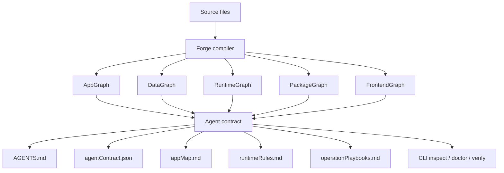
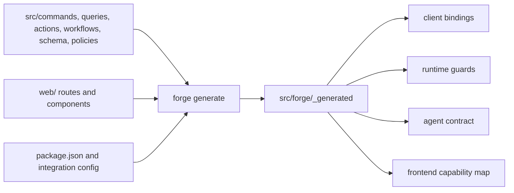
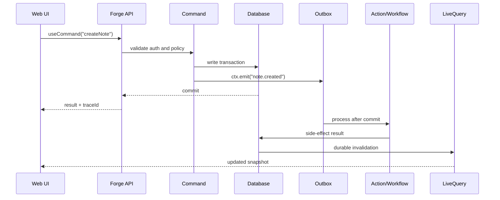
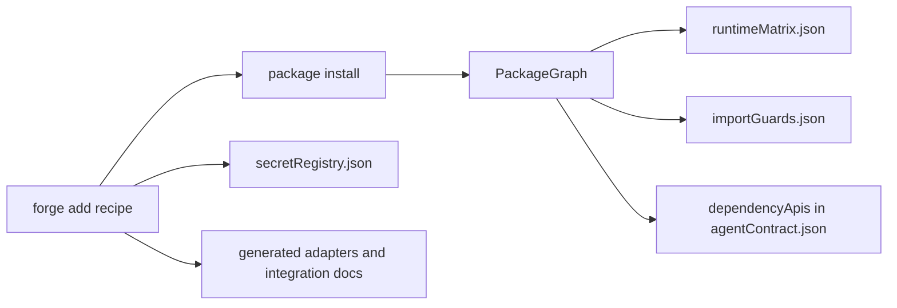
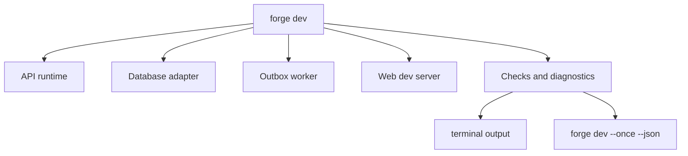

# Architecture

ForgeOS is a compiler, runtime, and development contract for full-stack apps. It turns source files into generated maps that humans, CLIs, CI, and AI coding agents can use safely.

## System overview



The source files remain the truth. Generated files explain that truth in stable JSON and Markdown.

## Main components

| Component | Responsibility |
|-----------|----------------|
| Compiler | Reads source files and emits generated graphs, manifests, contracts, and clients. |
| Runtime | Runs commands, queries, liveQueries, actions, workflows, endpoints, auth, secrets, telemetry, and AI. |
| Frontend bridge | Connects generated runtime entries to React hooks and records route/component usage. |
| Package intelligence | Turns `forge add` recipes and package metadata into PackageGraph, runtime compatibility, import guards, and dependency API summaries. |
| Guard system | Enforces runtime boundaries, package placement, generated drift, policies, and secret access. |
| Agent layer | Emits `AGENTS.md`, `agentContract.json`, playbooks, adapter exports, AI tools, repair plans, and review output. |
| Dev loop | Runs API, worker, checks, web server, diagnostics, and deterministic snapshots. |

## Compiler pipeline



`forge generate` is deterministic: no timestamps, no secret values, stable ordering. This makes generated drift easy to review and easy for agents to trust.

## Runtime boundaries

ForgeOS separates runtime contexts so side effects stay explicit.

| Context | Allowed | Forbidden |
|---------|---------|-----------|
| Command | Transactional writes, `ctx.db`, `ctx.emit`, buffered telemetry | Network, AI, secrets, direct `process.env` |
| Query | Read-only database access | Writes, emits, network, AI, secrets |
| LiveQuery | Read-only subscriptions, tenant-scoped dependencies | Writes, emits, network, AI, secrets |
| Action | Side effects after commit, network, secrets, AI, database access | Running before the command commits |
| Workflow | Durable orchestration, retryable steps, persisted outputs | Hidden side effects outside steps |
| Endpoint/server | Integration boundaries, HTTP, auth, secrets | Bypassing policies for app data |

`forge check --json` validates these boundaries. `runtimeRules.md` explains them for humans and agents.

## Request and side-effect flow



Commands stay deterministic. Actions and workflows handle side effects after commit. LiveQuery uses durable invalidations as the source of truth.

## Frontend contract

The compiler also reads `web/` when it exists. It emits:

```txt
src/forge/_generated/frontendGraph.json
src/forge/_generated/capabilityMap.json
```

These files connect frontend routes and components to commands, queries, liveQueries, and AI endpoints. They help agents answer:

- Which button calls which command?
- Which route reads which query?
- Which liveQuery updates this screen?
- Which runtime entries have no UI caller?
- Which UI calls bypass generated hooks?

Use:

```bash
forge inspect frontend --json
forge inspect capabilities --json
forge do connect-ui --json
```

## Package and integration contract

ForgeOS treats package installation as a compiler event. A recipe-backed integration starts with:

```bash
forge add stripe --dry-run --json
forge add stripe --json
```

The compiler then composes package evidence into the generated contract:



The DepLens-inspired dependency API commands expose the useful slice of `node_modules` without making an agent read it all:

```bash
forge deps inspect stripe --json
forge deps api stripe checkout.sessions.create --json
forge deps trace stripe --json
forge deps runtime-compat stripe --json
```

This layer answers two questions before code is written: "What is the SDK API?" and "Where may this package run?" Runtime guards enforce the answer during `forge check`.

## Agent-native layer

ForgeOS does not turn the framework into an autonomous coding agent. It makes the app legible to agents.

Important artifacts:

```txt
AGENTS.md
src/forge/_generated/agentContract.json
src/forge/_generated/agentTools.json
src/forge/_generated/appMap.md
src/forge/_generated/runtimeRules.md
src/forge/_generated/operationPlaybooks.md
```

Important commands:

```bash
forge do inspect --json
forge inspect all --json
forge dev --once --json
forge doctor
forge verify --standard
```

This layer gives agents project context, allowed commands, runtime rules, frontend wiring, package compatibility, dependency API evidence, repair hints, and verification gates.

## Local development loop



`forge dev` is the interactive loop. `forge dev --once --json` is the agent-friendly snapshot.

## Generated files policy

Generated files are safe to read and unsafe to hand-edit.

Edit:

```txt
src/commands/**
src/queries/**
src/actions/**
src/workflows/**
src/forge/schema.ts
src/policies.ts
web/**
```

Regenerate:

```bash
forge generate
forge check --json
```

Then verify:

```bash
forge verify --standard
```

## Related pages

- [Why ForgeOS](why-forgeos.md)
- [Agent Contract](agent-contract.md)
- [Runtime Model](runtime-model.md)
- [Frontend](frontend.md)
- [Testing and Repair](testing-and-repair.md)
