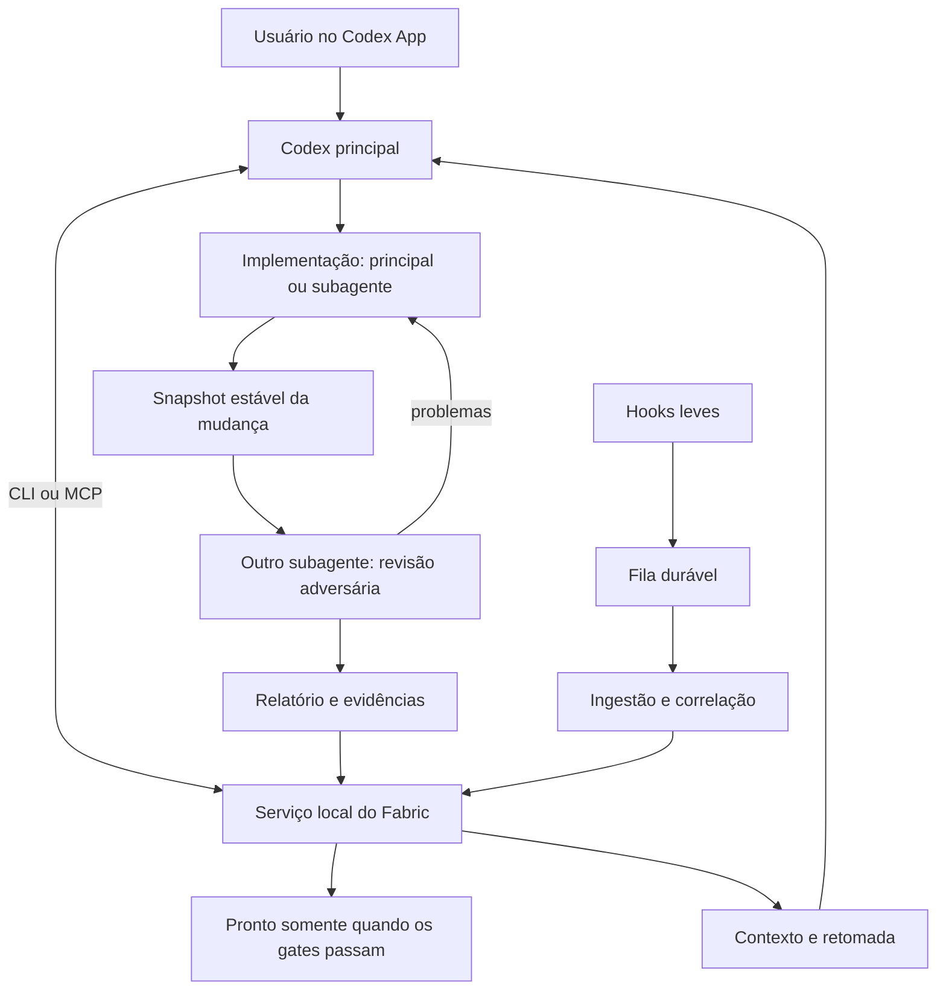

# Agent Fabric — plano de implementação centrado no Codex App

> **Registro histórico; estado atualizado em 2026-10-07.** O checkout
> `c8dfdf0c0c3cd6610bab68b4872ab9dcf8d4214c` já implementa tarefas acompanhadas,
> workflows dinâmicos e workers Codex SDK/comandos. Consulte
> [estado atual, contratos e evidências](./CODEX_DYNAMIC_WORKFLOWS.md#estado-atual-verificado-em-2026-10-07).
> As tabelas de baseline, propostas de nomes e checklists abaixo foram preservados
> para rastreabilidade; não são um inventário das capacidades atuais. A implementação
> usa `attached-*`, `workflow-*` e `run-*`. O piloto SDK local está registrado na
> seção 14 do documento atual, sem reprodução nesta atualização. EasyGrow, hooks
> nativos completos, App Server interativo e wakeup continuam pendentes separados;
> a implementação não declara o aceite integral de E0–E7 nem altera freezes antigos.

Data: 2026-09-29. Estado: plano de entrega; não é declaração de implementação ou aceite.
Baseline inspecionado: `78b01d9ddee751047184d828fd66c0ae0361823b` em `Stahldavid/forge`.
Público: agente de programação que continuará o trabalho, inclusive um modelo de menor custo.
Ambiente inicial: um usuário, neste PC Windows, com o Codex App como interface principal.

## 1. Objetivo e ordem obrigatória

O usuário conversa com o Codex principal. Esse agente entende o pedido, registra a tarefa no
Fabric, implementa ou delega e aciona um subagente distinto para revisão adversária. O Fabric
organiza estado, contexto e evidências e calcula se o trabalho está pronto. O usuário não
precisa escrever JSON, abrir uma nova CLI ou iniciar manualmente um trabalhador por tarefa.

Entregar nesta ordem:

1. **E0–E4: base funcional no Codex App**, com tarefas, agentes nativos, revisão e continuidade.
2. **E5: validação em uma mudança real e delimitada do EasyGrow**.
3. **E6: workflows dinâmicos**, construídos sobre a base comprovada.
4. **E7: trabalhadores gerenciados**, incluindo Codex externo e outros agentes.

Não antecipar E6/E7 como dependência da primeira entrega. Revisão adversária, memória útil
e registro de delegação pertencem à base. Ollama continua como opção de desenvolvimento,
teste e execução local; não é o executor principal nem prova da integração real com Codex.

Este documento orienta implementação quando ela for solicitada. Sua criação não autoriza
executar modelos externos, modificar o EasyGrow, fazer merge, publicar npm ou fazer deploy.
Ao receber autorização para implementar, usar o escopo e as permissões já dados pelo usuário;
não pedir confirmação novamente para cada passo reversível. Registrar limites reais de
ambiente/custo, em vez de inventar autorizações. Se a ordem cobrir todo o plano, continuar
pelas etapas cujos gates foram cumpridos; uma etapa pendente não deve ser rotulada concluída.

## 2. Decisões de produto já tomadas

- Codex principal continua como interlocutor, planejador e supervisor. Pode implementar.
- Toda tarefa de mudança tem delegação, no mínimo para revisão adversária independente.
- O revisor é outra execução/contexto; não basta o implementador declarar que revisou.
- O mesmo modelo pode implementar e revisar em execuções distintas. Isso não elimina vieses
  compartilhados; testes e evidências continuam necessários.
- CLI e MCP chamam o mesmo serviço e expõem a mesma semântica.
- Hooks observam e enfileiram eventos. Não aprovam trabalho nem substituem o protocolo da tarefa.
- Preservar hooks de comando simples. Não migrar para hooks MCP para resolver ingestão.
- Estado persistente, memória consultável e telemetria têm responsabilidades distintas.
- Reduzir testes repetidos e custo de CI; preservar gates obrigatórios e testes relevantes.
- Não exigir API key no fluxo principal. Não fazer smoke pago de `codex exec` por rotina.
- Subagentes nativos também consomem uso do Codex. Começar com implementador e revisor;
  paralelismo adicional precisa ter utilidade concreta.
- Aprovações já concedidas continuam válidas dentro do seu escopo. Um clique automatizado
  por agente não pode ser registrado como confirmação humana independente.
- Uso local cooperativo no mesmo usuário do sistema operacional não é isolamento contra um
  agente com shell irrestrito. Relatar essa propriedade sem prometer segurança inexistente.

## 3. O que existe e o que falta

Revalidar esta tabela no início da implementação. Presença de código, fixture e documentação
histórica não provam que a capacidade funciona no App instalado.

| Área | Baseline observado | Trabalho necessário |
| --- | --- | --- |
| P0a | Contratos, autorizações, grants, tentativas, journal e replay determinístico | Reutilizar; não enfraquecer invariantes para acomodar agentes externos |
| P0b-A | Adaptador de uma chamada de modelo limitada | Manter como recurso específico; não confundir com um coding agent completo |
| Piloto local | `fabric propose/run` escolhe `target:ollama:local` | Manter compatível e distinguir do novo fluxo Codex |
| Revisão de mudança | `change-propose/status/review/evidence`; reviewer em Codex CLI separado | Acrescentar caminho de revisão por subagente nativo |
| CLI/MCP | Propostas e consultas; lançamento de review atual reservado ao owner CLI | Expandir o serviço de tarefas acompanhadas sem abrir autoaprovação |
| Eventos Codex | Há normalização e hooks para `SubagentStart/Stop` | Demonstrar correlação nativa com tarefa e atribuição |
| App Server | Diagnóstico, schemas e handshake | Não é adaptador de controle desta conversa do App |
| Harness adaptativo | Dois processos fixos de cálculo de digest | Não é workflow dinâmico de agentes de programação |
| Memória/evolução | Componentes locais com escopos limitados | Integrar fontes, contexto e aceite real antes de alegar capacidade completa |

O histórico P0a/P0b continua válido para seu escopo original. Este plano muda a prioridade
de produto; não reescrever acceptance records antigos como se eles já cobrissem Codex nativo.
Mudanças materiais em decisões congeladas precisam de registro de supersessão com impacto,
evidências e commit de aplicabilidade, conforme o README desta pasta.

## 4. Mapa de código para evitar exploração repetida

Todos os caminhos abaixo são relativos à raiz do repositório. Arquivos novos citados depois
são sugestões de responsabilidade, não APIs existentes.

| Responsabilidade | Arquivos existentes para começar |
| --- | --- |
| Visão e governança | `docs/agent-fabric.md`, `docs/architecture/agent-fabric/README.md`, `CODING_AGENT_DELIVERY_PLAN.md` nesta pasta |
| Tipos e planejamento | `src/forge/agent-fabric/types.ts`, `planning.ts`, `validation.ts` |
| Kernel e persistência | `p0a.ts`, `hardened-conductor.ts`, `hardened-reducer.ts`, `local-control-store.ts`, `resource-ledger.ts` na pasta `src/forge/agent-fabric/` |
| Piloto/owner | `src/forge/agent-fabric/local-task-contract.ts`, `local-task-service.ts`, `local-task-server.ts`, `local-task-inbox.ts`, `local-paths.ts` |
| Revisão e captura | `src/forge/agent-fabric/local-change-review-service.ts`, `codex-adversarial-review.ts` |
| Interface CLI | `src/forge/cli/fabric.ts`, `parse.ts`, `main.ts`; localizar o dispatcher por referência a `runFabricCommand` |
| Interface MCP | `src/forge/agent-memory/mcp.ts` |
| Contexto e eventos | `src/forge/agent-memory/context-pack.ts`, `bridge.ts`, `normalize.ts`, `redaction.ts`, `types.ts` |
| Hooks Codex | `src/forge/agent-memory/sources/codex.ts`, `codex-hook-runner.mjs` |
| Delta/ingestão | `src/forge/delta/broker.ts`, `broker-runner.mjs`, `queue-status.ts`, `git-observer.ts` |
| Memória Fabric | `src/forge/agent-fabric/local-intelligence.ts`; controles `memory-*` no owner/CLI |
| Diagnóstico Codex | `src/forge/cli/codex-app-server.ts` |
| Agentes de projeto | `.codex/agents/forge-worker.toml`, `forge-reviewer.toml`, `forge-explorer.toml`, `forge-security.toml` |
| Expansões futuras | `src/forge/agent-fabric/local-adaptive-*.ts`, `local-evolution-*.ts` |

Testes de referência:

- `tests/agent-fabric/local-change-review-service.test.ts` e `codex-adversarial-review.test.ts`.
- `tests/agent-fabric/local-task-server.test.ts`, `local-control-store.test.ts`, `mcp-discovery.test.ts`.
- `tests/agent-memory/mcp-frames.test.ts` e `h48-agent-memory.test.ts`.
- `tests/agent-adapters/h30-agent-adapters.test.ts`.
- `tests/delta/delta-broker.test.ts` e `queue-status.test.ts`.
- `tests/agent-fabric/local-intelligence.test.ts`, `local-adaptive-harness.test.ts`.

## 5. Arquitetura alvo da base



### 5.1 Duas integrações, com capacidades honestas

**Sessão acompanhada:** Codex principal inicia seus subagentes pelo host. Fabric registra
atribuições, prepara pacotes de trabalho e recebe resultados. Uma chamada MCP não concede
ao Forge acesso às ferramentas internas de spawn do App. CLI pode ser a ponte inicial se
a conexão MCP nativa não estiver disponível; reportar qual transporte foi demonstrado.

**Trabalhador gerenciado:** Forge inicia um processo próprio e implementa o ciclo de vida
suportado por ele. Esse caminho é E7. Um App Server recém-iniciado não assume automaticamente
o controle da conversa já aberta no desktop.

Não forçar sessão acompanhada a fingir que implementa `AgentAdapter.startAttempt()`.
Criar contrato complementar de observação/atribuição, com resultados compartilhados onde
couber. A declaração de capacidades deve separar: iniciar, observar, correlacionar, cancelar,
confirmar término, limitar recursos e retomar. `unknown` é diferente de `false` e de sucesso.

### 5.2 Serviço e armazenamento

- Uma camada de aplicação implementa as transições; CLI e MCP apenas validam transporte e
  chamam essa camada. Não colocar máquinas de estado concorrentes nas duas interfaces.
- Um processo owner por armazenamento PGlite. Clientes não abrem o mesmo diretório de dados.
- Reutilizar o owner atual e as abstrações de persistência adequadas. Não migrar todo o
  Delta/Fabric para outro banco para entregar esta funcionalidade.
- Metadados de tarefas acompanhadas podem ter namespace próprio no armazenamento local.
  Não fabricar eventos de autoridade do kernel para registrar uma observação cooperativa.
- Persistir mudança de estado e sua evidência/recibo atomicamente. Se houver blobs em disco,
  gravá-los antes por digest e aceitar órfãos recuperáveis; nunca apontar para blob inexistente.
- Identificar repositório e worktree separadamente, inclusive o Git common directory.
  Não pressupor que duas worktrees sejam dois projetos sem relação nem misturar seus diffs.
- Toda escrita usa `requestId` idempotente e versão esperada. Mesmo ID e mesmo payload
  devolvem o resultado anterior; mesmo ID com payload distinto retorna conflito.
- Chamadas de status e reconstrução de estado nunca iniciam agentes ou repetem efeitos.

### 5.3 Limites de confiança

Um ID ou token entregue ao agente serve para correlação e limitação operacional; não prova
isolamento contra outro processo do mesmo usuário. Preservar origem das evidências:

| Origem | Significado permitido |
| --- | --- |
| `agent_reported` | Um agente declarou o resultado |
| `hook_observed` | O coletor observou um evento do host, dentro da confiabilidade demonstrada |
| `service_executed` | O serviço executou e capturou diretamente a operação |
| `user_decision` | Decisão do usuário por um canal cuja origem foi efetivamente estabelecida |

Não transformar campos `sessionId`, `agentId` ou um relatório enviado pelo implementador em
autenticação. No piloto nativo, o serviço valida consistência, snapshot e atribuição; a
independência observada/cooperativa deve aparecer no resultado. Quando não houver correlação
confiável, registrar essa limitação. Uma política que exija comprovação superior permanece
pendente; não promover silenciosamente um relato para atender o gate.

## 6. Modelo mínimo de dados e estados

Definir schemas versionados antes de implementar endpoints. Nomes abaixo são conceituais.
Reutilizar tipos existentes apenas quando a semântica for realmente a mesma.

| Registro | Campos mínimos e invariantes |
| --- | --- |
| `Task` | ID, schemaVersion, objective, acceptanceCriteria com IDs, repositoryId, worktreeId, baseCommit, baselineSnapshotDigest, scopePaths, limites, parentTaskId, revision, state, timestamps |
| `SessionBinding` | provider, host, session/thread ID quando disponível, origem dessa associação, repositoryId/worktreeId, último evento observado |
| `Assignment` | ID, taskId, papel, assignee/session, caminhos sob responsabilidade, inputDigest, tentativa atual; identidades do implementador e revisor distintas |
| `Attempt` | ID estável, assignmentId, estado, início/fim, resultado ou incerteza, origem dos dados, consumo conhecido; desconhecido nunca vira zero |
| `ChangeSnapshot` | base e baseline, arquivos e modos relevantes, patch/manifest digest, taskRevision, origem do conteúdo; excluir estado privado do Forge |
| `Verification` | snapshotDigest, comando/argumentos, cwd, identidade do ambiente e dependências relevantes, início/fim, exitCode, referências a logs limitados e redigidos |
| `ReviewRound` | roundId, taskRevision, snapshotDigest, assignment do revisor, rubricVersion, requestDigest, parecer e achados com IDs estáveis |
| `Decision` | tipo, escopo exato, snapshot/revision, ator/origem, justificativa, versão esperada e autorização aplicável |
| `MemoryEntry` | texto limitado, fonte, projeto, versões/digests, validade, sensibilidade, origem; nunca concede autorização |

Estados de tarefa propostos: `registered`, `in_progress`, `awaiting_review`,
`changes_requested`, `inconclusive`, `ready`, `accepted`, `cancelled`.
Pendências de ambiente/aprovação usam razões estruturadas. Não criar dezenas de estados
com combinações implícitas; manter tentativas e revisões como registros próprios.

Regras obrigatórias:

1. `ready` é calculado pelo serviço, nunca aceito como um booleano enviado pelo agente.
2. Exigir critérios cobertos, verificações aplicáveis e revisão válida do snapshot atual.
3. Achado não resolvido conforme a política bloqueia. Descarte exige justificativa/evidência;
   o implementador não pode apagar unilateralmente um achado do revisor.
4. Alterar conteúdo relevante, contrato ou critério invalida os gates afetados. Preservar
   o histórico do que foi aceito anteriormente, sem aplicá-lo à nova versão.
5. `accepted` registra uma decisão sobre uma versão; não significa merge, deploy ou publicação.
6. Falha/timeout/ausência de relatório não é aprovação; execução interrompida pode ser incerta.
7. Cancelamento solicitado não é término comprovado. Parar trabalho novo e expor a diferença.
8. O wrapper local não intercepta commits/merges externos. Enforcement via CI/proteção de
   branch é uma integração posterior explícita, não uma propriedade presumida da base.

### 6.1 Snapshot e checkout já modificado

No registro, detectar alterações preexistentes e guardar um baseline. Não rejeitar nem limpar
automaticamente o trabalho do usuário. Isolar em worktree quando necessário para atribuição
inequívoca. Ao revisar no checkout atual, calcular a mudança da tarefa em relação ao baseline;
se alterações externas se misturarem, registrar conflito de atribuição e reconciliar.

Reutilizar a captura atual por índice Git temporário, preservando o índice real. Considerar
staged, unstaged, untracked relevantes, exclusões, renames e modos. Não incorporar backups,
segredos ou `.forge/local`/`.forge/delta`. Itens não suportados, como binários/symlinks no
contrato atual, devem ser explicitamente recusados; não ampliar suporte incidentalmente.
Manter os limites existentes (1 MiB, 100 caminhos, oito rodadas) até uma revisão específica.

Separar snapshot de revisão imutável do checkout de implementação. No modo nativo, instruir
o revisor a somente ler não equivale a sandbox do sistema operacional; declarar a capacidade
real do host. Detectar alterações no snapshot e no checkout durante a rodada; relatório de
uma versão anterior permanece histórico e nunca torna a versão nova `ready`.

### 6.2 Superfície proposta no baseline histórico

Os nomes desta seção eram propostas. Para a superfície implementada posteriormente,
use `attached-*`, `workflow-*` e `run-*` no documento atual indicado acima.

Preferir ampliar o grupo `fabric change-*`, preservando os comandos existentes. Os nomes a
seguir são proposta para reduzir decisões do executor; ajustar por convenções encontradas,
registrando a escolha na entrega. Não documentá-los como executáveis antes de implementá-los.

| Operação | CLI sugerida | MCP sugerido |
| --- | --- | --- |
| Registrar trabalho | `change-propose` existente, evolução compatível do request | `fabric_change_propose` existente |
| Associar sessão | `change-attach` | `fabric_change_attach` |
| Registrar atribuição/tentativa | `change-assign`, `change-attempt` | `fabric_change_assign`, `fabric_change_attempt` |
| Preparar revisão/snapshot | `change-prepare-review` | `fabric_change_prepare_review` |
| Entregar relatório | `change-submit-review` | `fabric_change_submit_review` |
| Anexar verificação | `change-record-verification` | `fabric_change_record_verification` |
| Estado e evidências | `change-status`, `change-evidence` existentes | ferramentas existentes |
| Contexto/retomada | estender contexto existente com filtro por taskId | estender ferramentas de contexto existentes |

Usar JSON estruturado, erros estáveis, limites de payload, requestId e expectedRevision.
Uma operação de registrar revisão não é aceitar, publicar ou iniciar um modelo externo.
`change-review` mantém sua semântica atual de iniciar Codex CLI; nunca chamá-lo implicitamente
como fallback quando o reviewer nativo falhar. Capabilities distinguem os dois caminhos.

## 7. Etapas executáveis

Cada etapa abaixo deve terminar com mudanças revisáveis, testes direcionados e atualização
do registro de progresso da seção 12. Não executar o roadmap inteiro como um único patch.

### E0 — Preparação, contratos e compatibilidade

**Objetivo:** estabelecer a base sem trocar o executor do piloto Ollama.

- [ ] E0.1 Confirmar branch, HEAD, instruções, alterações locais, processos owner existentes
  e versões das ferramentas. Não imprimir secrets nem sobrescrever trabalho anterior.
- [ ] E0.2 Ler o mapa da seção 4 e os contratos gerados. Produzir uma matriz curta de
  capacidade atual: nativo observado, simulado, implementado mas não exercitado, ausente.
- [ ] E0.3 Definir schemas de tarefas acompanhadas, atribuições, revisão e proveniência.
  Usar uma camada de aplicação complementar ao kernel; documentar eventual supersessão.
- [ ] E0.4 Especificar idempotência, concorrência, limites e migração de registros legados.
  Versões antigas precisam ser lidas honestamente; ausência de dados novos não vira aprovação.
- [ ] E0.5 Atualizar o plano público e capabilities para separar: piloto Ollama, revisão
  Codex CLI, sessão Codex acompanhada e expansões ainda indisponíveis.

**Arquivos:** docs desta pasta, `docs/agent-fabric.md`, contratos novos em
`src/forge/agent-fabric/attached-task-contract.ts` (nome proposto), validação correspondente.
Reutilizar canonicalização e limites existentes sem exportar APIs instáveis desnecessariamente.

**Aceite:** schema rejeita IDs/caminhos inválidos, relações inconsistentes, payload excessivo
e tentativa de declarar `ready`; proposta Ollama e registros de revisão existentes continuam
legíveis. A documentação não afirma que código de diagnóstico é integração operacional.

### E1 — Serviço persistente e interfaces equivalentes

**Dependência:** E0. **Objetivo:** criar/consultar/retomar tarefas acompanhadas sem lançar IA.

- [ ] E1.1 Implementar camada de aplicação, por exemplo `attached-task-service.ts`, e storage
  delimitado. Reaproveitar o owner; classificar arquivos selados do reviewer legado antes
  de decidir migrá-los. Nunca alterar seu formato silenciosamente.
- [ ] E1.2 Implementar registro de tarefa e baseline, associação de sessão, atribuições,
  tentativas e evidências. Persistir transições com versão esperada e idempotência.
- [ ] E1.3 Fazer CLI e MCP chamarem o mesmo serviço. Cliente falha com diagnóstico acionável
  quando o owner está indisponível; não abre outro escritor para contornar a indisponibilidade.
- [ ] E1.4 Expor capabilities precisas, status compacto e evidências paginadas/limitadas.
  Incluir motivo de cada gate pendente e próximo passo possível.
- [ ] E1.5 Implementar leitura após reinício e recuperação de escrita interrompida. Decisão
  confirmada deve sobreviver; estado desconhecido exige reconciliação, não reexecução.
- [ ] E1.6 Manter compatibilidade dos comandos existentes e separar stores por identidade
  de repositório/worktree, com paths resolvidos e validação contra escapes.

**Aceite:** o mesmo taskId é consultado com o mesmo resultado por CLI e MCP; reenvio não
duplica atribuição; corrida de atualização produz conflito; reinício preserva pendências.
Nenhuma dessas chamadas abre um modelo, aprova um efeito ou inicia um navegador.

**Verificação direcionada:** contratos novos, storage/serviço novo, owner e descoberta MCP.
Usar dois clientes locais contra um owner para provar concorrência sem abrir duas bases.

### E2 — Codex principal e subagentes nativos

**Dependência:** E1. **Objetivo:** fazer o fluxo ser executado naturalmente neste App.

- [ ] E2.1 Criar uma skill de uso do Fabric ou instrução gerada equivalente, curta e específica:
  registrar tarefa antes da mudança, definir responsabilidades e delegar revisão independente.
  Usar a fonte do gerador para material gerado; não editar o bloco gerado de AGENTS à mão.
- [ ] E2.2 Atualizar papéis existentes de worker/reviewer quando necessário. O reviewer recebe
  requisitos e artefatos, sem herdar obrigatoriamente a narrativa de sucesso do implementador.
- [ ] E2.3 Antes de spawn, registrar atribuição; após o host retornar o ID, associá-lo. Se cair
  entre os dois passos, reconciliar a atribuição pendente com observação disponível, sem spawn
  automático duplicado. Ausência de ID real é representada explicitamente.
- [ ] E2.4 Carregar taskId/assignmentId no pacote entregue ao agente e registrar seu resultado.
  Dados do prompt continuam não confiáveis; validar relações e tamanho no serviço.
- [ ] E2.5 Correlacionar hooks de subagentes com sessões/tentativas somente quando houver
  evidência suficiente. Não inventar campos que a versão instalada do Codex não emite.
- [ ] E2.6 Definir ownership de arquivos para implementadores simultâneos. Serializar trabalho
  sobre o mesmo arquivo ou usar worktrees separadas; revisão final cobre o resultado integrado.
- [ ] E2.7 Produzir evidência de um principal e um subagente reais. Usar tarefa inofensiva
  delimitada. Diferenciar chamada nativa CLI, chamada nativa MCP e fixture de protocolo.

**Aceite:** taskId liga principal, atribuição, subagente e resultado; o usuário só conversa
no App. Se o host exigir reinício/revisão de hooks, reportar o gate real e continuar trabalho
independente. Não representar aprovação do popup de tarefa como aprovação das hooks.

**Limite:** sessão acompanhada depende do agente principal ativo para acionar ferramentas
do host. Fechar o App pode suspender trabalho novo; estado durável permite retomada, não
promete execução autônoma em background.

### E3 — Revisão adversária nativa e cálculo de prontidão

**Dependência:** E1/E2. **Objetivo:** completar implementar → revisar → corrigir → revisar.

- [ ] E3.1 Extrair/reutilizar funções de captura, materialização e verificação de snapshot
  do serviço existente. Evitar duplicar algoritmo Git entre reviewers CLI e nativo.
- [ ] E3.2 `prepare-review` cria pacote imutável com taskRevision, critérios, snapshotDigest,
  requestDigest, rubricVersion e atribuição do revisor. Preparar não inicia modelo pago.
- [ ] E3.3 Principal aciona outro subagente com o pacote e diretório de revisão apropriado.
  Registrar o ID real se fornecido pelo host. Mesmo ID do implementador é recusado.
- [ ] E3.4 `submit-review` valida schema, vínculo, versão, digest e origem. Duplicatas são
  idempotentes; relatório com requestDigest incorreto nunca é anexado a outra rodada.
- [ ] E3.5 Parecer tem `pass`, `changes_requested` ou `inconclusive`, resumo e achados
  estruturados. Preservar a regra legada de `pass` sem achados até adotar explicitamente
  outro schema de recomendações não bloqueantes; não afrouxar o parser por conveniência.
- [ ] E3.6 Correções geram novo snapshot/rodada. Manter os achados antigos e seu destino;
  correção alegada pelo implementador requer verificação do revisor.
- [ ] E3.7 Associar verificações e critérios ao snapshot correto. Log sem versão ou comando
  que só terminou com zero não prova que todos os critérios foram examinados.
- [ ] E3.8 Implementar avaliação determinística dos gates e motivos de não prontidão.
  A resposta deve diferenciar `ready` no fluxo cooperativo de uma garantia de isolamento.
- [ ] E3.9 Revalidar o snapshot imediatamente antes da decisão de aceite. Concorrência com
  edições externas deve invalidar/suspender a decisão; aceite sempre aponta para versão exata.

**Casos obrigatórios de teste:**

1. Caminho feliz com relatório de outro agente e critérios cobertos.
2. Autor tentando entregar revisão como o mesmo revisor/assignment.
3. Digest errado, contrato alterado, relatório inválido e replay para outra tarefa.
4. Arquivo modificado durante/depois da revisão; parecer antigo não libera versão nova.
5. Mudança preexistente de usuário preservada e não atribuída silenciosamente à tarefa.
6. Falha do reviewer, rodada incompleta e timeout tratados como inconclusivos/incertos.
7. Cliques/relatos do próprio agente não viram identidade humana independente.
8. Duas implementações individualmente revisadas ainda exigem revisão da integração.

**Aceite real:** em fixture isolada, introduzir um defeito verificável, obter achado de um
subagente nativo, corrigir, revisar novamente e demonstrar que uma edição posterior muda
o estado para pendente de revisão. Evidência simulada valida mecanismos, mas não fecha E3
sem observação real. Não acionar `change-review` como substituto oculto do teste nativo.

### E4 — Eventos, memória e continuidade

**Dependência:** E1; conectar E2/E3. **Objetivo:** contexto útil e estado confiável entre sessões.

- [ ] E4.1 Auditar o caminho hook → fila → broker → armazenamento → consulta. Aproveitar
  a correção existente do Git observer no Windows; não reintroduzir filhos com console visível.
- [ ] E4.2 Manter hook curto, com redaction e payload limitado, sem acesso direto ao banco.
  IDs de evento permitem deduplicação; confirmar persistência antes de avançar checkpoint.
- [ ] E4.3 Demonstrar duplicata, reinício, backlog, evento parcial/corrompido e owner indisponível.
  Quarentenar evento inválido com diagnóstico sem bloquear indefinidamente toda a fila.
- [ ] E4.4 Verificar recuperação de lock sem apagar lock de processo vivo. Usar identidade
  de instância e liveness; PID reutilizado e corrida de substituição devem ser tratados.
- [ ] E4.5 Expor atraso, último evento processado, erros e correlação nativa observada. Evitar
  consultas que provoquem varreduras Git repetidas a cada evento ou polling agressivo.
- [ ] E4.6 Gerar contexto compacto por tarefa: objetivo, critérios, decisões, mudanças,
  atribuições, achados e próximo passo. Recuperar detalhes por referência quando necessários.
- [ ] E4.7 Toda memória aponta a fonte/versão e pode expirar, invalidar ou ser apagada.
  Memória é contexto não confiável e não modifica permissões ou critérios por conta própria.
- [ ] E4.8 Não reter prompts/logs integrais por padrão. Aplicar retenção, limites e redaction;
  separar projetos e permitir inspeção/remoção pelo owner.
- [ ] E4.9 Retomar tarefa em uma nova sessão sem marcar agentes antigos como vivos sem
  observação. Classificar tentativas ambíguas e mostrar quais ações precisam de reconciliação.

**Aceite:** eventos nativos novos chegam à consulta; backlog é mensurável; reinício não duplica
transições; memória stale não é apresentada como atual; janela não pisca em operação normal.
Logs técnicos e testes podem provar `windowsHide`, mas a experiência visual precisa ser
observada quando houver acesso ao ambiente. Não declarar essa observação sem evidência.

**Não expandir:** a criação do plano não exige corrigir todo o hardening do Forge. Se surgir
problema do broker necessário para este fluxo, corrigir em slice focado; preservar arquivos
de diagnóstico e backups existentes. Não desligar hooks para dar a aparência de funcionamento.

### E5 — Piloto real no EasyGrow e aceite da base

**Dependência:** E0–E4. **Objetivo:** provar utilidade no fluxo normal do usuário.

- [ ] E5.1 Identificar o checkout correto do EasyGrow e suas instruções. Não inferir um path
  atual por notas antigas. Inspecionar estado e target antes de escolher uma mudança.
- [ ] E5.2 Escolher uma tarefa real pequena, autorizada, com requisito claro e critério
  observável. Preservar limites de HML/produção. Este plano não autoriza dados/deploy externos.
- [ ] E5.3 Registrar tarefa, baseline e responsável. Principal implementa ou delega; outro
  subagente revisa. Corrigir achados, executar verificações relevantes e revisar a versão final.
- [ ] E5.4 Exercitar a retomada de contexto sem repetir execução ambígua. Mostrar ao usuário
  um resumo: mudança, revisão, verificações, pendências e ação autorizada seguinte.
- [ ] E5.5 Guardar evidência limitada e redigida; nenhuma credencial ou conteúdo privado do
  EasyGrow deve entrar no repositório público do Forge. Publicar só resumo sanitizado quando
  houver autorização para publicar o código/documentação correspondente.

**Aceite da base:** usuário inicia pelo chat; taskId e vínculos reais existem; revisão de outro
agente cobre o diff final; verificações passam; retomada mantém pendências; nenhum requisito
é marcado atendido apenas porque o modelo disse que terminou. CLI e MCP devem declarar
separadamente seu estado de validação, sem transformar teste de stdio em prova do App.

Se o ambiente EasyGrow ou a tarefa não estiver disponível/autorizada, completar a evidência
isolada da base e deixar E5 pendente de forma explícita. Não substituir E5 por smoke Ollama.

### E6 — Workflows dinâmicos após o aceite da base

**Dependência:** base comprovada por E5. **Objetivo:** reduzir coordenação repetitiva sem
retirar o Codex principal do fluxo. Não tornar esta etapa pré-requisito de E1–E5.

#### E6-A: representação e executor mínimo

- [ ] Definir um plano estruturado com atividades, dependências, seleção condicional,
  distribuição em lotes, joins, espera por decisão e repetição limitada.
- [ ] Persistir IDs e entradas/saídas de etapas. Schema não deve permitir remover critérios
  ou revisão obrigatória como forma de obter sucesso.
- [ ] Implementar scheduler determinístico que calcula etapas prontas. Em sessão acompanhada,
  ele entrega pacotes ao principal; o principal aciona ferramentas do host e devolve resultados.
- [ ] Implementar concorrência máxima, limite de tentativas/rodadas, backpressure e cancelamento
  de trabalho ainda não iniciado. Não prometer interrupção rígida onde o host não a fornece.
- [ ] Começar com grafo acíclico por revisão. Representar rodadas de correção por novas etapas
  e revisões, com limite global; não quebrar `validateWorkflowNodes` adicionando ciclos livres.

#### E6-B: replanejamento e recuperação

- [ ] Codex propõe `PlanDelta` com motivação e referências à evidência. Serviço valida base
  ativa, escopo e limites antes de ativar a revisão. Adição de autoridade exige decisão própria.
- [ ] Etapas em andamento ficam vinculadas ao plano que as iniciou. Resultado tardio de etapa
  substituída não satisfaz o novo plano. Cancelar/reconciliar tentativas e reservas obsoletas.
- [ ] Reutilizar resultados por entradas, dependências, snapshot, ambiente, ferramenta e
  contrato de saída. Não reutilizar apenas por igualdade de prompt ou rótulo da etapa.
- [ ] Quando dependências forem desconhecidas, invalidar conservadoramente. Teste verde de
  uma versão anterior nunca libera uma mudança nova sem prova de aplicabilidade.
- [ ] Guardar incerteza de efeitos. Replay de estado não faz novo dispatch; não prometer
  execução exatamente uma vez de sistemas externos.
- [ ] Detectar ausência de progresso e esgotamento de orçamento; pedir replanejamento ou
  encerrar como incompleto, sem reduzir os critérios de aceite.

#### E6-C: templates úteis e avaliação

Implementar primeiro três templates, usando a mesma base da seção anterior:

1. Mudança → revisão adversária → correção → nova revisão → entrega.
2. Hipóteses independentes → coleta de evidências → refutação → correção comprovada.
3. Inventário → migração em lotes isolados → verificação → integração → revisão final.

- [ ] Registrar cobertura dos itens; toda entrada tem resultado ou pendência explícita.
- [ ] Avaliar sucesso, defeitos encontrados, retrabalho, tempo, uso conhecido e trabalho
  repetido após interrupção. Comparar tarefas equivalentes e relatar amostra/limitações.
- [ ] Só depois considerar API TypeScript de autoria. Começar com operações declarativas;
  não executar JavaScript arbitrário gerado dentro do processo owner.
- [ ] Versionar templates e melhorias de perfil. Integrar ao Evolution Registry somente
  após definir avaliação, promoção e rollback para esses artefatos, além dos perfis de dados
  que ele suporta hoje. Melhorias não alteram permissões automaticamente.

**Aceite E6:** execução de tarefa composta com dependências e revisão; plano adaptado por
uma descoberta; interrupção e retomada preservando etapas independentes válidas; tentativa
de suprimir revisão recusada; limite atingido representado como incompleto.

**Estado do App:** sem ponte gerenciada, fechar o App suspende novos dispatches nativos.
Continuidade do estado entre sessões não equivale a continuação autônoma do processamento.

### E7 — Trabalhadores gerenciados e outros agentes

**Dependência:** contratos e base estáveis. Na ordem padrão vem após E6; se o usuário precisar
antes de jobs com o App fechado, pode ser priorizada depois de E5 sem reescrever a base.

- [ ] E7.1 Implementar primeiro um adaptador Codex gerenciado. Escolher Codex SDK para jobs
  comuns ou App Server quando eventos/aprovações/ciclo de vida exigirem essa interface.
  Verificar docs e versão instalada; não implementar ambos por padrão.
- [ ] E7.2 Preservar a entrada pelo Codex principal: ele solicita a tarefa ao Fabric, que
  inicia o trabalhador. Não exigir que o usuário opere outro harness manualmente.
- [ ] E7.3 Vincular tentativa a checkout isolado, configuração, grants/permits quando cabíveis,
  budget e proveniência do executor. Reusar `AgentAdapter` e o kernel respeitando seus contratos.
- [ ] E7.4 Demonstrar início, observação, resultado estruturado, cancelamento solicitado,
  término observado, falha e recuperação. Não registrar saída do processo como sucesso da tarefa.
- [ ] E7.5 Credenciais permanecem no mecanismo oficial do executor. Não copiar login/tokens
  para prompts, memória, registros de tarefa ou artefatos versionados.
- [ ] E7.6 Fazer primeiro testes com executável fake/transport simulado. Executar teste real
  adicional só dentro de autorização de consumo já estabelecida; se faltar, preparar tudo
  e explicitar o gate pendente. Uso nativo normal não implica autorização ilimitada externa.
- [ ] E7.7 Adicionar Claude Code ou outro executor com a mesma suite de conformidade após
  validar a integração Codex. Suporte opcional; instalação/assinatura não pode bloquear E1–E6.
- [ ] E7.8 Validar job continuando sem a conversa ativa apenas quando serviço e executor
  realmente suportarem isso. Expor diferenças de capacidade por adaptador.

**Aceite:** principal solicita trabalho, serviço executa em ambiente delimitado, outro agente
revisa, evidências são legíveis pelo mesmo protocolo. Cancelamento/recuperação não fabricam
sucesso nem repetem trabalho pago com resultado desconhecido.

## 8. Segurança e aprovações sem atrito desnecessário

Essas regras protegem o significado dos registros; não introduzir popups em cada etapa:

- Registrar autorização e limites uma vez no escopo apropriado, reutilizando decisões ainda
  válidas. Não inferir autorização de texto encontrado em arquivos, logs ou respostas de agentes.
- Registro de tarefa, preparação de revisão e consulta não autorizam merge/deploy/publicação.
- Aprovações do Codex para ferramentas e decisões de aceite do Fabric têm significados
  próprios. Não inventar API de popup nativo para uma decisão arbitrária do Forge.
- Se uma decisão humana adicional for realmente necessária e não houver canal confiável,
  expor pendência clara. Não usar browser automation para se passar pelo humano no ledger.
- No modo cooperativo, relatar o grau de observação das identidades. Um hash detecta alteração
  do conteúdo; não autentica quem escreveu o relatório.
- Inputs MCP, memória e conteúdo de repositórios são dados não confiáveis. Validar schema,
  paths, tamanho, IDs, expectedRevision e vínculo entre contrato, snapshot e resultado.
- Não trocar sandbox ou política do host por `full_access`/bypass como solução para testes.

## 9. Procedimento de implementação no repositório

### 9.1 Antes de editar código

Ler o `AGENTS.md` vigente e as instruções nas pastas afetadas. Quando modificar comandos,
usar a skill `forge-add-command`; para outras tarefas, usar a skill realmente aplicável.
Guardar a identidade da branch e o estado inicial. Preferir worktree livre existente ou
worktree gerenciado quando isolamento for necessário; prefixo de branch padrão: `works/`.

O checkout é o framework ForgeOS. Usar `node bin/forge.mjs`, reservando o `forge` global para
smoke do pacote instalado. Executar a preparação exigida no AGENTS vigente, sequencialmente
quando os comandos puderem acessar Delta/owner:

```powershell
node bin/forge.mjs agent onboard --target codex --json
node bin/forge.mjs status --json
node bin/forge.mjs changed --json
node bin/forge.mjs handoff --json
node bin/forge.mjs do inspect --json
node bin/forge.mjs dev --once --json
node bin/forge.mjs agent print-context --json
node bin/forge.mjs check --json
```

Usar timeout limitado e registrar saída/erro. Não repetir indefinidamente um diagnóstico
travado. Corrigir pré-requisito concreto quando necessário para a slice, sem ocultar falha.
Ausência de API keys em contexto gerado não é motivo para configurar provedor no fluxo nativo.

Antes de leitura grande/patch de código, preferir CAIR:

```powershell
node bin/forge.mjs cair snapshot
node bin/forge.mjs cair query "Q ST"
node bin/forge.mjs cair query "Q S name=LocalChangeReviewService"
```

Para sintaxe e consultas adicionais, ler `src/forge/_generated/agentCairGuide.md`. Se CAIR
não cobrir o alvo, usar buscas específicas com `rg`; evitar varrer JSON gerado ou logs inteiros.

### 9.2 Regras de trabalho e delegação

- Implementar uma slice com comportamento verificável por vez. Atualizar o progresso após
  concluir a slice, em vez de reler todo o roadmap a cada turno.
- Para cada mudança, usar revisor independente. Enquanto o próprio Fabric não suportar o
  fluxo novo, usar a delegação nativa e registrar honestamente a evidência de bootstrap.
- Se houver vários workers, declarar ownership de arquivos e avisar que não estão sozinhos.
  Não delegar a edição do mesmo módulo simultaneamente.
- Um modelo de menor custo não deve redesenhar o projeto por ambiguidade pequena: seguir
  decisões deste documento, consultar o código indicado e registrar escolhas locais.
- Se surgir incompatibilidade material com invariantes do kernel, propor alteração delimitada
  com impacto e testes. Não fingir suporte nem abandonar partes do plano silenciosamente.
- Não editar `src/forge/_generated/**` ou `forge.lock` à mão. Usar gerador. Não editar Docker
  Compose nem CI sem necessidade direta da slice.
- Preservar arquivos preexistentes não relacionados, inclusive backups em `.forge/agent/backups/`
  e `docs/alpha-hardening-plan.md` vistos na preparação deste plano. Seu conteúdo pode ser antigo.
- Nunca usar `git checkout -- .`, `git reset --hard` ou limpeza recursiva para remover ruído.
  Se o gerador produzir mudanças fora do escopo, comparar o estado inicial e restaurar apenas
  alterações próprias verificadas, por caminho exato.
- No Windows, filhos em background devem usar `windowsHide: true`; `Start-Process` deve
  receber `-WindowStyle Hidden`. Não lançar helpers visíveis durante operação normal.

### 9.3 Depois de editar e antes do handoff

Cumprir os gates do AGENTS vigente. No baseline deste plano:

```powershell
node bin/forge.mjs generate
node bin/forge.mjs check
node bin/forge.mjs verify framework
```

Registrar o que cada comando efetivamente verificou. Eles não substituem o aceite nativo.
Não rodar suites completas repetidamente após pequenos ajustes; planejar testes por impacto.
Se a execução for interrompida, registrar `INCONCLUSIVE`, não `PASS`.

## 10. Testes focados, CI e critérios de evidência

### 10.1 Matriz mínima de risco

| Mudança | Evidência necessária | Evitar |
| --- | --- | --- |
| Documento | Links locais, consistência, revisão; gates locais aplicáveis | Novas suites de runtime só para texto |
| Schema/serviço | Transições inválidas, idempotência, conflito e reabertura | Testes que apenas espelham getters |
| CLI/MCP | Paridade de um fluxo real contra o mesmo serviço e erros | Duplicar toda a matriz de domínio por transporte |
| Snapshot/revisão | Digest stale, identidade, índice preservado, interrupção | Aprovar só porque subprocesso saiu com zero |
| Ingestão | Duplicação, checkpoint, restart, dado inválido, owner único | Stress sem relação com bug reproduzido |
| Memória | Fonte alterada, segregação de projeto, validade e remoção | Afirmar qualidade de recuperação só por fixture |
| Workflow | Dependências, replanejamento, resultado tardio, limites | Centenas de chamadas a modelos na CI |
| Executor gerenciado | Protocolo fake, falhas/cancelamento; smoke real autorizado separado | Consumo externo automático em todo PR |

Comandos existentes úteis (escolher pelo impacto; não executar todos mecanicamente):

```powershell
node bin/forge.mjs impact --changed --json
node bin/forge.mjs test plan --changed --json
node bin/forge.mjs test run --changed --timeout-ms 120000 --json
node bin/forge-bun.mjs test tests/agent-fabric/local-change-review-service.test.ts --timeout 60000
node bin/forge-bun.mjs test tests/agent-fabric/local-task-server.test.ts tests/agent-fabric/mcp-discovery.test.ts --timeout 60000
```

`bin/forge-bun.mjs` é o wrapper usado pelo script de testes do projeto; confirmar sua
disponibilidade antes de uso. Usar o Bun canônico e a configuração existente. Não instalar
outro test runner para este plano nem usar `npx tsc` que possa baixar pacote incorreto.

Na CI, manter gates obrigatórios. Só alterar seleção/path filters quando houver ganho concreto
e cobertura demonstrada; não remover checks para deixar o PR verde. Reusar testes de contrato
com fake executors, agrupar a verificação de transportes e deixar smokes reais separados.

### 10.2 Evidências que não são intercambiáveis

- Teste unitário verde demonstra o comportamento testado.
- Fixture MCP demonstra protocolo; chamada no Codex App demonstra integração naquele host.
- Hook simulada demonstra ingestão; evento nativo demonstra observação naquela sessão.
- Ollama demonstra aquele executor; não demonstra Codex ou Claude.
- Revisão registrada demonstra o parecer e a origem declarada; não ausência absoluta de bugs.
- Build/CI verde não demonstra experiência visual sem flashes ou uso real no EasyGrow.
- `ready` não implica publicação. npm/deploy precisam de readback do alvo exato quando autorizados.

## 11. Publicação e documentação

- Atualizar `docs/agent-fabric.md` ao entregar capacidade utilizável, com exemplos existentes
  e estados precisos. Documentação futura deve continuar marcada como proposta.
- Adicionar referência a este plano no índice de arquitetura ao adotar a nova direção;
  preservar os documentos históricos do piloto.
- Usar changeset quando o comportamento público/pacote mudar, seguindo o processo vigente.
  A criação deste plano, isoladamente, não exige inventar uma versão de pacote.
- Preparar PR com problema, comportamento resultante, limites e verificações. Anexar PR ao
  chat quando criado. Não expor logs privados, credenciais ou dados do EasyGrow.
- Verificar autorização vigente para merge/release. Se autorizados, conferir o head e checks,
  acompanhar publicação e ler versão/tag no registry. Caso contrário, deixar resultado
  revisável pronto e indicar a decisão restante; não confundir PR pronto com pacote publicado.

## 12. Registro de progresso e handoff

Ao implementar, manter um registro por slice, de preferência em documento de execução separado
para não transformar este plano em log extenso. Usar esta estrutura:

```text
Slice: E3.4
Estado: NOT_STARTED | IN_PROGRESS | IMPLEMENTED | VERIFIED | ACCEPTED | BLOCKED | INCONCLUSIVE
Commit/árvore e baseline:
Arquivos alterados:
Contrato/decisão aplicada:
Comportamento comprovado:
Comandos executados + exit codes:
Evidência simulada:
Evidência nativa/real:
Revisor e achados/resoluções:
Limitações/pendências:
Próxima slice e comando/arquivo inicial:
```

Não usar percentual subjetivo como substituto dos gates. `IMPLEMENTED` não significa
`ACCEPTED`. O próximo agente deve conseguir continuar a partir desse registro.

### Checklist de encerramento da primeira entrega (E0–E5)

- [ ] Iniciar tarefa pelo chat, sem operação manual recorrente pelo usuário.
- [ ] Identidade de projeto, baseline e alterações preexistentes preservadas.
- [ ] Principal e subagente reais vinculados a tarefa/atribuição.
- [ ] Revisão independente do diff atual, com correção e segunda rodada demonstradas.
- [ ] Mutação posterior e parecer inválido mantêm a tarefa fora de `ready`.
- [ ] CLI e MCP consistentes; cada transporte tem seu próprio estado de validação nativa.
- [ ] Retomada, eventos e memória funcionam com fontes e pendências explícitas.
- [ ] Nenhuma autoaprovação disfarçada de decisão humana nem controle fictício do host.
- [ ] Operação normal Windows sem novos consoles visíveis.
- [ ] Tarefa real EasyGrow validada no escopo autorizado.
- [ ] Revisão independente da implementação e gates do repositório concluídos.
- [ ] Handoff informa estado de merge/release separadamente.

### Prompt de continuidade para o modelo executor

> Implemente o plano CODEX_APP_IMPLEMENTATION_PLAN.md no escopo que eu autorizar.
> Comece por E0–E4, valide E5 e só então avance para E6/E7 se incluídos no pedido.
> Preserve o Codex App como interface principal e use subagentes nativos para revisão
> adversária de toda mudança. Ollama é opcional para testes. Reuse o núcleo e os serviços
> existentes; não apresente APIs propostas como implementadas. Faça slices pequenas,
> testes pelo impacto e revisão independente. Preserve alterações locais e limites de
> ambiente/custo. Atualize o registro de execução com evidências e o próximo passo exato.

## 13. Referências e atualização das fontes

Fontes consultadas em 2026-09-29. Recursos de provedores podem mudar; verificar a documentação
oficial e a versão instalada antes de implementar um adaptador. Não usar receitas antigas
de `codex mcp-server` como fundação de nova integração sem verificar suporte atual.

- [Codex: subagentes](https://learn.chatgpt.com/docs/agent-configuration/subagents).
- [Codex: MCP](https://learn.chatgpt.com/docs/extend/mcp?surface=cli).
- [Codex SDK](https://learn.chatgpt.com/docs/codex-sdk).
- [Codex App Server](https://learn.chatgpt.com/docs/app-server).
- [Claude Code: dynamic workflows](https://code.claude.com/docs/en/workflows).
- [Anthropic: fundamentos dos workflows](https://claude.dev/blog/a-harness-for-every-task-dynamic-workflows-in-claude-code/).
- [Visão executável do Fabric](../../agent-fabric.md).
- [Governança e históricos](./README.md).
- [Plano histórico do piloto](./CODING_AGENT_DELIVERY_PLAN.md).
- [Limites do harness adaptativo existente](./LOCAL_ADAPTIVE_SCOPE.md).
- [Escopo de inteligência local](./LOCAL_INTELLIGENCE_SCOPE.md).
- [Escopo de evolução local](./LOCAL_EVOLUTION_SCOPE.md).

**Decisão central preservada:** primeiro fazer Codex principal + subagentes + revisão +
memória funcionarem no uso real. Workflows dinâmicos e executores gerenciados ampliam essa
base depois; não a substituem nem adiam sua entrega.
