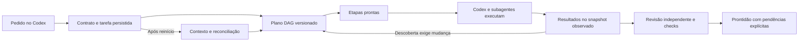

# Agent Fabric: tarefas Codex e workflows dinâmicos

Data: 2026-10-05. Baseline: `78b01d9ddee751047184d828fd66c0ae0361823b`.
Este documento detalha a implementação solicitada pelo usuário e seus critérios de aceite.
O plano anterior `CODEX_APP_IMPLEMENTATION_PLAN.md` permanece como contexto histórico.
Resultados de execução e limites observados ficam no registro de validação ao final.

## Estado atual verificado em 2026-10-07

Checkout consultado: `c8dfdf0c0c3cd6610bab68b4872ab9dcf8d4214c`.
Esta atualização é uma conferência documental e de código; não reexecuta os pilotos,
não declara publicação dessa revisão e não altera os aceites históricos P0a/P0b.

| Capacidade | Estado e limite de evidência |
| --- | --- |
| Tarefas acompanhadas | `attached-*` implementado: contrato, persistência, snapshots, revisão distinta, checks, cobertura e prontidão. Relatos conservam proveniência `agent_reported`. |
| Workflows dinâmicos | `workflow-*` implementado: DAG versionado, dependências, decisões, joins, tentativas limitadas, replanejamento e reconciliação. No modo acompanhado, o Codex executa as etapas. |
| Workers gerenciados | `run-*` implementado: Codex SDK e comandos, clones Git isolados, composição de artefatos, preparo de dependências, eventos, controles e aplicação local com gates de revisão/verificação. |
| Piloto SDK real | Registrado na seção 14 em 05/10/2026; execução demonstrada pela CLI. O registro não prova integração nativa MCP nesta conversa nem foi reproduzido nesta atualização. |
| Repositórios existentes | Manifesto, mapas, consultas e contexto implementados; operação e limites em [`../../repository-analysis.md`](../../repository-analysis.md). Análise não exige aplicação Forge; runs gerenciados exigem Git com HEAD. |
| Observações de runtime | Suporte opcional e explícito documentado em [`../../repository-runtime-observation.md`](../../repository-runtime-observation.md). Evidência observada não substitui gates de verificação. |
| Trabalho pendente separado | Piloto EasyGrow, aceite completo de hooks nativos, controle interativo por App Server e wakeup/serviço de sistema. Não declarar E0–E7 integralmente aceitos. |

Limites atuais dos runs gerenciados: 32 nós, concorrência 4, 100 tentativas totais,
20 revisões e até 30 minutos por executor. O owner precisa permanecer vivo; não há
garantia de execução com o App fechado. Revisões e checks precisam corresponder ao
snapshot aplicável. No bridge acompanhado, a invalidação considera o escopo inteiro
da tarefa, sem granularidade completa por `inputRefs`.

Os planos `CODEX_APP_IMPLEMENTATION_PLAN.md`, `CODING_AGENT_DELIVERY_PLAN.md` e
`REPOSITORY_MANIFEST_PLAN.md` preservam decisões e propostas dos seus baselines.
Checklists antigos e a restrição `proposal_only` do MCP legado não descrevem todas
as capacidades atuais: `fabric_run_start` despacha workers e pode consumir uso Codex.
Use este resumo para localizar o estado atual e as seções seguintes para contratos,
procedimentos e registros de validação; suporte no checkout não comprova versão
publicada, implantação, execução contínua ou aceite em outro projeto.

### Comparação com Claude Code Dynamic Workflows

Comparação consultada em 2026-10-07. No Fabric, o plano é um DAG declarativo
versionado; no Claude Code, um script JavaScript controla a orquestração. Ambos
podem dividir trabalho, reunir resultados e compor revisão independente.

| Dimensão | Fabric/Forge no checkout consultado | Claude Code Dynamic Workflows |
| --- | --- | --- |
| Próxima etapa | Scheduler e dependências; mudanças por revisão explícita do plano | Condições, loops e chamadas do script |
| Resultado aplicável | Contratos de saída e snapshots; prontidão da tarefa acompanhada e gates de aplicação gerenciada | Resultados dos agentes reunidos pela lógica do script |
| Recuperação | Tentativas incertas exigem reconciliação; replan preserva obrigações | Replay de resultados salvos; falha ou mudança de prompt pode reexecutar agentes posteriores |
| Execução | Acompanhada pelo Codex ou gerenciada por SDK/comandos | Runtime de workflows integrado ao Claude Code |

No Fabric, não confundir o scheduler acompanhado com despacho automático de workers.
O modo gerenciado tem limites próprios e exige owner vivo. Revisões/checks vinculados
ao snapshot não garantem correção do modelo ou aceite humano; registros acompanhados
continuam cooperativos. O bridge acompanhado invalida conservadoramente pelo escopo
inteiro, não somente por entradas individuais de cada nó.

No Claude Code, o script coordena e os agentes acessam arquivos/comandos. A retomada
depende da sessão e dos resultados salvos; execução em background tem condições próprias.
Não afirmar que Claude não possui revisão, persistência ou recuperação. Também não
inferir que o Fabric é superior em qualidade, custo ou velocidade sem avaliação pareada.
Valores de limites, disponibilidade e comportamento do fornecedor devem ser atualizados
nas fontes oficiais antes de orientar uma nova execução.

Fontes do Claude: [documentação dos workflows](https://code.claude.com/docs/en/workflows)
e [apresentação oficial](https://claude.com/resources/articles/introducing-dynamic-workflows-in-claude-code).
Fonte do Fabric: contratos e serviços em `src/forge/agent-fabric`, incluindo
`workflow-engine.ts`, `workflow-task-actions.ts`, `managed-run-contract.ts` e
`managed-run-service.ts`; registros de validação nas seções 12 e 14 deste documento.

## 1. Experiência pretendida

O usuário pede o trabalho no Codex App. O Codex principal registra o objetivo, implementa
ou delega, pede uma revisão a uma execução distinta e registra verificações. O Fabric
preserva tarefas, versões, snapshots, pendências e evidências. Uma nova conversa recupera
o pacote de continuidade e identifica o que ainda precisa ser feito.

Workflows dinâmicos acrescentam um plano executável de etapas: o serviço devolve atividades
prontas e o Codex as executa com suas ferramentas nativas. Descobertas podem produzir uma
nova revisão do plano; resultados independentes permanecem utilizáveis e os afetados são
invalidados. O serviço não precisa iniciar outro modelo para organizar o trabalho.

Persistência não implica execução com o App fechado. O modo acompanhado espera o Codex
retomar. Workers gerenciados pelo SDK agora têm contrato e execução próprios, descritos
na seção 11. O owner precisa permanecer vivo; a implementação não comprova, sozinha,
o piloto real do SDK nem execução com o App fechado.



## 2. Baseline e compatibilidade

- Preservar kernel P0a, eventos aceitos, grants, digests e replay.
- Preservar contratos e comandos do piloto Ollama.
- Preservar o revisor Codex CLI e seus registros de revisão.
- Criar um contrato próprio para tarefas acompanhadas; não alterar silenciosamente o
  significado de `ready` do serviço de revisão legado.
- Não modificar manualmente os artefatos gerados ou descartar alterações preexistentes.
- Reutilizar o owner local e o protocolo de transporte; não criar outra instância PGlite
  sobre o armazenamento existente.
- Manter os workflows de aplicação separados dos planos do Agent Fabric. Seu runtime
  sequencial é uma referência de infraestrutura, não um executor de DAG adaptativo.

## 3. Modelo de dados

Cada tarefa contém objetivo, critérios com IDs estáveis, escopo de arquivos, HEAD de base,
checks obrigatórios, versão de concorrência, sessões, atribuições e tentativas.

Uma atribuição identifica papel, sessão e agente. Uma tentativa identifica uma execução
concreta, com estados running, succeeded, failed ou uncertain. O implementador e o revisor
precisam ter agentIds distintos; subagentes da mesma conversa podem compartilhar sessionId.
Os IDs declarados são evidência cooperativa, não identidade criptográfica do processo.

Cada snapshot inclui HEAD de base e atual, escopo, conteúdo real dos arquivos, deleções,
arquivos novos não ignorados e informações relevantes de modo. Ele usa um digest estável.
Escopos são relativos ao repositório; links simbólicos e caminhos que escapem da raiz são
rejeitados. Há limites de arquivos e bytes para evitar captura sem limites.

A revisão é preparada antes de receber o relatório. O token relaciona snapshot, tentativa
do implementador e tentativa do revisor. Relatórios com token, digest ou atribuição
divergentes não contam. Uma alteração posterior invalida a aplicabilidade da revisão.

Verificações contêm checkId, digest, resultado, comando e resumo. Cobertura relaciona cada
critério com sua evidência e snapshot. Registros enviados por agentes são `agent_reported`;
não são convertidos em comandos executados ou verificações autenticadas pelo serviço.

## 4. Persistência e concorrência

Estado local em `.forge/local/agent-fabric/attached-tasks`, independente do banco legado.
O envelope possui digest de integridade. Mutações são protegidas por lock entre processos,
com substituição atômica de arquivo, validação de caminhos e controle de versão.

Toda mutação tem requestId e, após a criação, expectedVersion. Reenviar exatamente a mesma
requisição devolve o resultado já registrado. Reutilizar o requestId com outro conteúdo
falha. Uma versão antiga não sobrescreve trabalho concorrente. O resultado somente é
reconhecido após a gravação persistente; uma queda não pode fabricar um sucesso.

Locks publicam atomicamente um arquivo de identidade já gravado e sincronizado por hardlink
exclusivo. Isso evita uma janela em que outro processo veja um lock sem proprietário.
Um PID morto pode ser recuperado sob um guard de recuperação; locks vivos não são roubados.
As respostas de mutações são recibos compactos, sem copiar todo o estado para cada recibo.
Use status/context para obter o estado completo. Hardlinks exigem um filesystem compatível;
o piloto local foi realizado no NTFS deste computador.

Digest local detecta corrupção e mudanças acidentais. Outro programa com acesso irrestrito
à mesma conta Windows pode modificar os arquivos; este não é um isolamento entre usuários.

## 5. Operações acompanhadas

| Operação | Finalidade |
| --- | --- |
| attached-propose | Criar objetivo, critérios, escopo e checks |
| attached-status | Ler versão e prontidão para o snapshot atual |
| attached-context | Recuperar objetivo, estado, evidências e pendências |
| attached-attach | Associar uma sessão e seu agente |
| attached-assign | Registrar uma atribuição de implementação ou revisão |
| attached-attempt | Registrar início e resultado de uma execução |
| attached-prepare-review | Preparar revisão vinculada ao snapshot e tentativas |
| attached-submit-review | Receber o relatório da execução distinta |
| attached-record-verification | Registrar resultado atribuído de um check |
| attached-cover | Registrar evidência para um critério |

CLI: `node bin/forge.mjs fabric <operação> --file request.json --json` para mutações.
Leituras usam `--task-id <id>`. MCP expõe nomes `fabric_attached_*` equivalentes.
Novos transportes requerem um `fabric serve` ativo e chamam o mesmo serviço do owner.

O Codex prepara os corpos das requisições; o usuário não precisa escrever JSON no fluxo
normal. Schemas são estritos, payloads limitados e os transportes não concedem autorização
para iniciar modelos externos, executar comandos arbitrários ou publicar mudanças.

## 6. Prontidão calculada

A tarefa fica pronta somente se:

1. Uma revisão distinta aprova o snapshot vigente.
2. Não há findings relevantes sem resolução registrada.
3. Todos os checks exigidos passaram para esse snapshot.
4. Todos os critérios têm cobertura vinculada ao mesmo snapshot.
5. Não há tentativas running ou uncertain pendentes.
6. Se há workflow, suas obrigações terminaram validamente.

O serviço devolve motivos estruturados quando isso não ocorre. A prontidão permanece
explicitamente baseada na proveniência disponível. Testes reais e revisão humana têm
seus próprios critérios de aceite e não são substituídos por um parecer do modelo.

## 7. Workflow mínimo

O workflow é dado versionado; não é JavaScript arbitrário. Seus nós têm ID, tipo,
dependências, digest das entradas, referências de contexto e contrato de saída.

- activity: investigação, implementação ou revisão executada por um agente.
- verification: etapa de verificação com resultados e evidências.
- join: reúne resultados somente quando suas dependências são válidas.
- decision: escolhe caminhos opcionais, com seleção explícita e auditável.

O scheduler devolve pacotes com entradas e resultados de dependências. claim registra
quem assumiu uma etapa. result registra sucesso, falha ou incerteza. Um sucesso requer
digest de saída e evidências compatíveis com o contrato; uma mensagem de conclusão isolada
não satisfaz o protocolo.

No bridge persistente, um sucesso em `workflow-result` ou `workflow-reconcile` também exige
`observedSnapshotDigest` no corpo da requisição, fora de `result`. O executor deve capturar
esse digest ao observar o código que executou ou verificou. O serviço compara a observação
com o snapshot atual e rejeita um resultado antigo, inclusive após recuperação. Ler um
digest mais novo para carimbar evidências antigas viola o protocolo; IDs e relatos dos
agentes continuam sendo cooperativos.

Limites: concorrência, tentativas por nó, tentativas totais e revisões. Tokens e custo
somente têm teto rígido quando o executor consegue medi-los e aplicá-los. O modo nativo
não anuncia controle que o Fabric não possui.

Fanout expande uma lista em nós concretos. Condições escolhem ramos. Repetições limitadas
usam novas tentativas ou revisões. O grafo continua acíclico; não há eval nem shell do plano.

## 8. Replanejamento e recuperação

Replan exige revisão esperada, motivo e referências às evidências que motivaram a mudança.
Nós alterados e seus dependentes perdem resultados aplicáveis; nós independentes mantêm
resultados ainda compatíveis. IDs de tentativas e histórico não são reciclados.

O motor puro preserva resultados de nós independentes. A camada de tarefas vincula cada
resultado ao escopo inteiro de arquivos da tarefa: uma mudança nesse escopo torna resultados
anteriores obsoletos até replanejamento e nova execução. Esta versão não resolve granularidade
por `inputRefs`; mantenha o escopo pertinente. Referências de contexto são dados, não comandos.

Critérios de aceite pertencem ao contrato. Nós obrigatórios e exigências de evidência
não podem ser enfraquecidos por um replanejamento. Alterar autorização ou objetivo é uma
decisão separada; trocar uma estratégia não pode apagar uma obrigação.

Uma tentativa interrompida é uncertain, não failed nem succeeded. recover registra essa
incerteza. reconcile recebe evidências do resultado conhecido antes de liberar uma nova
tentativa. Resultado atrasado de uma revisão inválida não pode concluir a etapa vigente.

Operações: workflow-plan, workflow-next, workflow-claim, workflow-result, workflow-replan,
workflow-reconcile e workflow-recover, disponíveis pela mesma CLI/MCP e owner.

## 9. Sequência e critérios de entrega

| Entrega | Critério verificável |
| --- | --- |
| Contrato e store | Replay exato, CAS, corrupção detectada, restart e concorrência |
| Sessões e revisão | Tentativas distintas, token/digest corretos, nova mudança invalida review |
| Prontidão | Check falho, cobertura ausente ou tentativa incerta impede ready |
| Transporte | CLI e MCP observam a mesma tarefa e mesmos erros no owner |
| DAG persistente | Dependências, limites, join, decisões e recuperação sem duplicação |
| Replanejamento | Invalidação transitiva, preservação independente e obrigações imutáveis |
| Piloto Forge | Mudança real, revisão independente, checks e registro de continuidade |
| Piloto EasyGrow | Mudança delimitada escolhida sob a autorização daquele projeto |
| Workers gerenciados | SDK, comandos, isolamento, CAS e recuperação implementados; piloto SDK local registrado na seção 14 |

Arquivos novos de contrato/store/service/readiness ficam em `src/forge/agent-fabric`.
Engine puro, templates e bridge de tarefas têm arquivos próprios nessa pasta.
Transportes ampliam `cli/fabric.ts`, `cli/parse.ts`, `cli/main.ts`, `agent-memory/mcp.ts`
e `local-task-server.ts`. Testes ficam em `tests/agent-fabric`.

## 10. Validação eficiente

Usar fixtures descartáveis para persistência, mudanças de arquivo e transportes. Testar
falhas que importam: CAS, replay divergente, snapshot obsoleto, auto-revisão, relato inválido,
join prematuro, ciclo, orçamento, interrupção e resultado atrasado.

Executar testes focados, typecheck e lint. Em seguida executar generate, check e verify
framework exigidos pelo repositório, preservando diferenças geradas anteriores.
Não repetir checks caros sem mudança ou falha que justifique.

Realizar um piloto com agentes Codex nativos; separar sua evidência da fixture MCP e do
revisor CLI simulado. Registrar limitações das hooks e não interpretar um evento Stop
como satisfação de requisitos. No preflight atual o broker de memória estava indisponível;
a funcionalidade deve operar pelo protocolo explícito sem depender desse broker.

## 11. Execução gerenciada implementada pelo Codex SDK

O chat nativo continua sendo a interface do usuário. O Codex prepara os requests e usa
a CLI ou `fabric_run_*` quando este MCP já estiver registrado no host. A entrega não
instala MCP nem altera configuração global. `attached-*`/`workflow-*` continuam sendo
o modo acompanhado, com execução pelo chamador e evidência `agent_reported`.

O novo contrato `managed-run-contract/store/service`, `managed-workspace` e
`codex-sdk-worker` inicia uma execução própria pelo SDK. `run-start` persiste a tentativa
antes do despacho e retorna um ack compacto. O owner agenda o DAG e cria clones Git
isolados da base observada, aplicando os artefatos das dependências antes de cada etapa.
Implementadores só podem alterar seu `writeScope`, contido em `scope`; reviewers e
comandos são somente leitura. Os clones não copiam `node_modules` do checkout principal.
O preparo automático instala dependências usando o manifesto e lockfile do clone, com
scripts ignorados por padrão, ou copia um cache verificado para o ambiente isolado.
Não compartilha uma pasta mutável de dependências com o checkout principal.
`environment` controla `{mode: "auto"|"none", ignoreScripts, registry, timeoutMs}`;
o default é auto com ignoreScripts true. Registry deve ser HTTPS sem credenciais, query
ou fragmento, e o prazo vai de 100 a 1800000 ms. Use none para etapas sem dependências.

O owner observa processo, término, snapshot de entrada, diff e uso retornado pelo SDK.
Status declara `provenance: "executor_observed"`, mas conteúdo do relatório continua
`reportProvenance: "agent_reported"`. Contratos dos nós aceitam somente o tipo de evidência
`"executor-observed"`; repetir um rótulo como `"test-passed"` não certifica seu significado.
Um comando bem-sucedido comprova aquele comando, sem aceite humano ou implantação implícitos.

Publicação local ocorre ao final se `publish` não for `false`. Havendo implementadores,
ela exige um reviewer Codex obrigatório e um comando obrigatório, ambos dependentes
de todos os writers. A revisão precisa aprovar, os comandos devem passar e o workflow
deve completar sobre a base compatível. O owner aplica diffs locais, sem commit, push
ou deploy. `publish: false` mantém resultados nos clones e artefatos.

### Operações, CAS e retomada

| CLI | Corpo | Comportamento |
| --- | --- | --- |
| `run-start --file spec.json` | requestId, goal, scope, workflow, executors, publish opcional | Despacha processos |
| `run-status --run-id ID` | Leitura | Estado, versões, etapas e artefatos |
| `run-wait --file wait.json` | runId, cursor opcional, waitMs de 0 a 30000 | Eventos, cursor e cursorExpired |
| `run-steer --file request.json` | CAS e instruction | Enfileira instrução e pausa novos despachos |
| `run-pause --file request.json` | CAS | Pausa despacho; workers ativos podem terminar |
| `run-resume --file request.json` | CAS; replan opcional | Retoma depois de resolver incertezas |
| `run-cancel --file request.json` | CAS | Solicita interrupção, sem desfazer efeitos externos |
| `run-reconcile --file request.json` | CAS e resolução | Reconcilia tentativa ou publicação incerta |

CAS é `{runId, requestId, expectedVersion}`. Leia a versão antes de mutar. Reutilize
requestId apenas com corpo idêntico; após conflito leia estado e crie outro requestId.
Acks retornam runId/version/status; status retorna estado completo, sem bytes base64 dos
artefatos. No MCP, `fabric_run_status` recebe `{runId}`; os demais recebem
`{request: CORPO_COMPLETO}`. Os sufixos são start/status/wait/steer/pause/resume/cancel/reconcile.

Replan em resume acrescenta `expectedRevision`, `nodes`, `executors`, `reason` e
`evidenceRefs`, preservando obrigações e limites. Steer vale para etapas futuras, sem
injetar mensagem na execução ativa. Após restart ou cancelamento, inspecione diretórios,
threadId e efeitos antes de retentar. Reconciliação de tentativa incerta só aceita
`{attemptId, resolution: "failed", reason}`; não aceita sucesso inventado pelo chamador.
A nova tentativa pode reutilizar uma thread SDK salva em novo workspace isolado.
`{publication: "confirm"}` só confirma publicação incerta quando o owner observa os
arquivos esperados; divergência permanece bloqueada.
`{publication: "retry"}` exige que o owner observe a base original completa; limpa a
intenção, pausa o run e exige resume explícito. Não sobrescreve uma publicação parcial.

### Exemplo mínimo sem modelo

Em um repositório Git contendo `source.txt`, salve `run.json`. Ajuste o caminho absoluto
do Node instalado. inputDigest identifica o contrato do nó; calcule o SHA-256 da definição
da etapa. O valor abaixo é SHA-256 de `ok`, apenas para este smoke. O owner captura
separadamente o snapshot real de entrada: esse digest declarado não é prova de fonte.

```json
{
  "requestId": "command-smoke-1",
  "goal": "Observar um comando no clone isolado",
  "scope": ["source.txt"],
  "publish": false,
  "workflow": {"workflowId": "command-smoke", "nodes": [{
    "nodeId": "verify", "kind": "verification", "dependsOn": [],
    "inputDigest": "sha256:2689367b205c16ce32ed4200942b8b8b1e262dfc70d9bc9fbc77c49699a4f1df",
    "required": true,
    "outputContract": {"requiredEvidenceKinds": ["executor-observed"]}
  }]},
  "executors": [{"nodeId": "verify", "type": "command",
    "argv": ["C:/Program Files/nodejs/node.exe", "-e", "process.stdout.write('ok')"],
    "timeoutMs": 10000}]
}
```

```powershell
node bin/forge.mjs fabric capabilities --json
node bin/forge.mjs fabric serve --json
# Outra sessão com o owner vivo:
node bin/forge.mjs fabric run-start --file run.json --json
node bin/forge.mjs fabric run-status --run-id RUN_ID_RETORNADO --json
# wait.json: {"runId":"RUN_ID_RETORNADO","cursor":0,"waitMs":1000}
node bin/forge.mjs fabric run-wait --file wait.json --json
# pause.json: {"runId":"RUN_ID_RETORNADO","requestId":"pause-1","expectedVersion":VERSAO_ATUAL}
node bin/forge.mjs fabric run-pause --file pause.json --json
```

Para código, amplie o DAG para `implement -> review -> verify`: activity com executor
Codex role implementer, prompt e writeScope; activity obrigatória com executor Codex
role reviewer e prompt; verification obrigatória com executor command e argv do teste.
Cada nó precisa de inputDigest e executor próprio. Use `publish: true` no escopo autorizado.
Acrescente decision/investigator e replan quando descobertas mudarem as etapas.

Máximos atuais: 32 nós, concorrência 4, 100 tentativas totais, 20 revisões, prazo por worker
de 30 minutos e espera de eventos de 30 segundos. O owner precisa estar vivo: não há
auto wakeup, serviço de sistema instalado ou promessa de execução com o App fechado.
Encerrar o owner aborta workers e preserva estado; reabrir trata interrupções como incertas.

Cancelamento é best effort até observar término. Queda após despacho sem resultado é
incerta e exige reconciliação. O executor não assume controle da conversa aberta no App.
Um smoke simulado não comprova consumo, sandbox ou integração nativa real. Implementados:
SDK, comandos, CAS, eventos, isolamento, composição de artefatos, revisão e recuperação.
O piloto SDK real passou em 05/10/2026, com o registro de evidência na seção 14:
threads/uso reais, revisão e comando sobre o artefato, publicação observada
e retomada/cancelamento. App Server interativo, wakeup, hooks completos e piloto EasyGrow
continuam propostas separadas.

Fontes oficiais: https://learn.chatgpt.com/docs/agent-configuration/subagents,
https://learn.chatgpt.com/docs/codex-sdk e https://learn.chatgpt.com/docs/app-server.

## 12. Registro de validação

Implementado: contrato/store/readiness, tarefas acompanhadas, transporte compartilhado
CLI/MCP, motor DAG, templates de mudança/revisão e investigação, replanejamento,
recuperação e skill de projeto `.agents/skills/forge-agent-fabric`.

- Suite focada final: 22 testes, zero falhas, 171 assertions; inclui subprocessos reais
  da CLI, dono autenticado, corrupção, concorrência, replay e snapshot obsoleto.
- Typecheck, lint, generate, check e validação estrutural da skill passaram.
- Piloto Forge: implementação real por agentes Codex nativos; a revisão independente
  encontrou dois problemas, corrigidos antes da revisão aprovada sobre o snapshot final.
- Avaliação descartável pela CLI: restart do owner, contexto persistido, recuperação de
  tentativa incerta, rejeição de evidência antiga e nova verificação aplicável passaram.
- Gate amplo: a primeira execução passou 67 dos 68 chunks e demais etapas, com uma
  falha de inicialização do subprocesso no teste existente de hook H48. O teste isolado
  passou na repetição isolada, mas a repetição serial inteira reproduziu a falha. O
  diagnóstico capturou ETIMEDOUT/SIGTERM no spawnSync do Bun/Windows após cerca de 8 ms,
  apesar do prazo de 6.000 ms. O probe usa agora seu executor assíncrono existente, com
  payload e limites preservados, diagnóstico completo e regressão de timeout real.
  A repetição final e o gate são registrados no relatório de entrega.

Resultado final: `verify framework --json` passou todas as 11 etapas, com 1.366 testes
passando, zero falhas, 245 arquivos e 69/69 chunks. A suite H48 após a correção passou
38 testes; a regressão de subprocesso também passou. O piloto terminou ready true,
sem motivos pendentes, e manteve estado, versão e digest após nova abertura do owner.
O aviso de RLS PGlite é estrutural; não houve prova de isolamento no Postgres, CI ou
implantação. Logs e scripts do piloto ficam em `work` no checkout.

O MCP foi validado pelo harness de protocolo e owner, sem instalar o servidor na
configuração global do Codex. A CLI foi executada de verdade. Hooks nativos completos,
EasyGrow e o aceite SDK não foram cobertos por este piloto acompanhado. A tarefa
nativa mantém proveniência `agent_reported`, inclusive quando os comandos foram
efetivamente observados nesta conversa.

## 13. Operação concreta pelo Codex

1. Ler `fabric capabilities --json`, localizar o owner ou iniciar `fabric serve --json`.
2. Registrar a tarefa com contrato delimitado. Exemplo de arquivo para `attached-propose`:

```json
{
  "requestId": "change-example-001",
  "goal": "Implementar a mudança solicitada e verificar seus critérios",
  "criteria": [{"criterionId": "behavior", "description": "Comportamento esperado demonstrado"}],
  "scope": ["src/component.ts"],
  "requiredChecks": ["targeted-tests", "typecheck"]
}
```

3. Guardar o taskId devolvido. Leituras usam `fabric attached-context --task-id <id> --json`.
   Cada mutação posterior usa taskId, requestId novo e expectedVersion obtido do status.
4. Anexar agentes reais, criar atribuições e registrar tentativas. Construir o plano
   com `createChangeReviewWorkflow` ou `createInvestigationWorkflow` exportados por
   `forgeos/agent-fabric`; enviar workflowId, nodes e limits a `workflow-plan`.
5. Ler `workflow-next`, assumir uma etapa com `workflow-claim` e expectedRevision.
   Executar com as ferramentas do Codex. O Fabric não despacha agentes automaticamente.
6. Para resultado bem-sucedido, usar este formato, substituindo os exemplos por valores
   realmente observados:

```json
{
  "taskId": "<taskId>",
  "requestId": "result-example-001",
  "expectedVersion": 4,
  "attemptId": "implement-1",
  "observedSnapshotDigest": "<digest observado antes de produzir a evidência>",
  "result": {
    "status": "succeeded",
    "outputDigest": "sha256:<digest real da saída>",
    "evidenceRefs": ["artifact:change-report"],
    "evidenceKinds": ["change-snapshot"]
  }
}
```

7. Preparar e submeter revisão independente no token/snapshot corretos. Registrar checks
   e cobertura depois de verificar o código. Concluir review/verify/accept conforme as
   dependências, sem antecipar o aceite.
8. Em queda, ler contexto e recuperar as tentativas interrompidas. Reconciliar efeitos
   conhecidos; resultados obsoletos recebem falha justificada e nova execução após replan.
9. Apresentar ready apenas se os motivos pendentes estiverem vazios. Conservar contexto,
   recibos e relatório; não publicar ou implantar sem a autorização pertinente.

A execução gerenciada opt-in está implementada na seção 11 e não é necessária para usar
o modo acompanhado. O registro histórico acima conserva o gate da entrega acompanhada;
não atribui aquele resultado ao código gerenciado adicionado depois. O piloto SDK próprio
está registrado abaixo. EasyGrow deve ser escolhido e autorizado no contexto daquele projeto.

## 14. Piloto real do executor SDK em 05/10/2026

O chat original do Codex conduziu o owner autenticado pela CLI. Em um repositório Git
descartável, o SDK 0.160.0 usou o login ChatGPT já configurado, sem nova chave de API:

1. Dois implementadores executaram em paralelo, cada um em um clone separado. As duas
   threads emitiram `thread.started` antes da primeira emitir `turn.completed`.
2. Um implementador propôs adicionar uma terceira etapa. O owner bloqueou novos
   despachos; o coordenador aceitou a proposta com CAS e evidência da tentativa.
3. O workflow passou da revisão 1 para 2, adicionando o terceiro implementador e
   preservando as duas saídas já concluídas. Houve quatro threads SDK no workflow.
4. O revisor independente leu os três arquivos compostos e aprovou. Um comando Node
   verificou seus bytes. O owner registrou a intenção e publicou `A`, `B`, `C` no
   checkout local do piloto; não houve commit, push ou deploy.
5. Uma quinta thread, somente de investigação, foi interrompida após `turn.started`.
   A tentativa permaneceu incerta. Após inspeção e reconciliação explícita como falha,
   um novo owner de serviço retomou a mesma thread e obteve conclusão observada.
6. Um novo processo confirmou os dois runs concluídos e os arquivos publicados,
   sem novas chamadas ao modelo. O encerramento duplicado do serviço legado no script
   de piloto foi corrigido e a leitura/encerramento independente passou.

Evidências locais entregues: `PILOTO_CODEX_SDK_REAL.json`,
`PILOTO_CODEX_SDK_RECUPERACAO.json` e `PILOTO_CODEX_SDK_READBACK.json`, na pasta de
outputs da conversa. As contagens de uso são as retornadas pelo SDK, com cache separado;
não representam preço em dinheiro nem garantem disponibilidade ilimitada do plano.

A configuração global deste computador já contém `forge_fabric_local`. Os novos tools
`fabric_run_*` foram validados pelo harness MCP. Eles não estavam carregados no catálogo
desta conversa; por isso a execução real demonstrada foi pela CLI, preservando o chat
como interface. O App pode precisar recarregar o servidor para descobrir os novos tools.

O isolamento MCP foi verificado com o binário distribuído pelo SDK: os cinco servidores
herdados foram explicitamente desativados antes dos workers. Isso não é uma prova de
contenção contra agente malicioso com acesso ao mesmo usuário do sistema operacional.
Os snapshots aceitam arquivos individuais até 16 MiB, total até 128 MiB; cada artefato
persistido pelo serviço tem limite de 8 MiB. Clones não incluem `node_modules` do
checkout principal. Manifests, lockfiles e configurações de workspace são capturados
também como contexto somente de leitura, incluindo alterações locais fora do escopo;
isso evita instalar dependências de um commit antigo. Outras alterações fora do escopo
não são incluídas automaticamente. O contrato `environment` prepara dependências por
padrão, com lockfile congelado, cache verificado e copiado, e scripts ignorados.
Instalações reais com npm são verificadas separadamente nos testes do ambiente;
a execução real própria dos gerenciadores pnpm, Yarn e Bun ainda não foi validada.

O piloto prova o fluxo local delimitado. Cancelamento exige observação/reconciliação;
não foi provado encerramento de toda árvore de processos. Publicação de vários arquivos
não é uma transação atômica contra desligamento do computador. Uma publicação parcial
permanece bloqueada para inspeção. Não há wakeup do chat ou serviço de sistema instalado.
