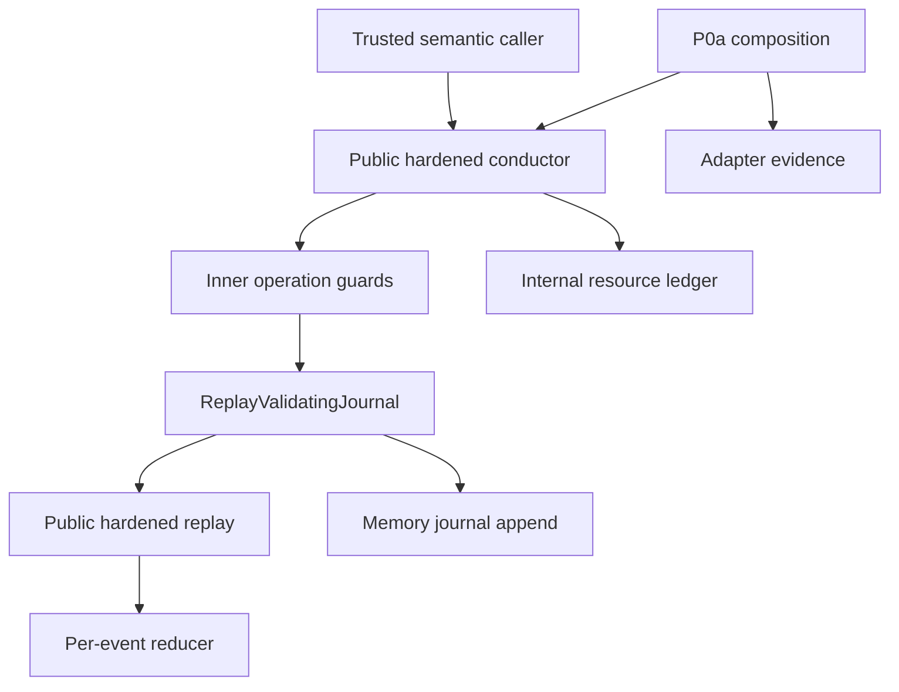

# S1.2 — Reference Implementation Design

**Record ID:** `AF-S1.2-DESIGN-2026-09-10`

**Status:** `DESIGN_CANDIDATE`; not adopted. S12-F01 and S12-F02 repairs adopted separately in PR #15 and PR #17.

**Source and governance baseline:** `main@2ca5ba7d261cf4001aa755581caa4b29de109b35`.

## 1. Authority, coordinates and reading convention

[PR #14](https://github.com/Stahldavid/forge/pull/14) adopted the
[scope and gate](S1.2_SCOPE_AND_GATE.md) and [plan](S1.2_DESIGN_PLAN.md) at `main@d1e6a1bb605527f242b7a6fb6fa05d6ff3561f92`,
on 2026-09-10T15:05:48Z. Its reviewed head was
`ec3e60c91f0321eaa0ff28f579ef6ceb14051f04`; merge parents are
`4b796f49c480d782ec7e069f8eb5f7eae841876a` and that head, in order.
Retained PLANNING_PROPOSAL headings identify historical documents, not pending planning
adoption. S12-P06 is complete; S12-D12 is not.

The movement from S1.1 adoption to PR #14 was four documentary files only. The next
movement, [PR #15](https://github.com/Stahldavid/forge/pull/15), adopted the compatible
S12-F01 repair at `d9275f4773c1082a993ffaf7b6a58d15eb139246` on 2026-09-10T17:43:18Z. Its reviewed head
was `16157c8bd59feecef6aa31692ba90a0d94f84307`; merge parents are
`d1e6a1bb605527f242b7a6fb6fa05d6ff3561f92` and that head. The merge tree equals the reviewed tree.
Only L.reserve and its new 15-regression file changed (+106/-2); schema, conductor,
authority, reducer, journal, canonicalization and adopted normative inputs did not.
The ledger is therefore no longer byte-identical to P0a. Historical P0a and S1.1 evidence
retains its original coordinates; the repair's evidence is additional, not retroactive.

The latest movement, [PR #17](https://github.com/Stahldavid/forge/pull/17), adopted S12-F02
at the stated source baseline on 2026-09-11T11:24:27Z. The merge parents are
`d9275f4773c1082a993ffaf7b6a58d15eb139246` and reviewed head
`a832e29a3e8c757249eb8a59b7774d6521b4853e`; merge and reviewed trees are identical.
Its eight-file delta (+402/-203) updates A/C/R/HC/HR/L, adds internal dictionary helpers
and 70 regressions. The current mapping reassesses those six components and their
identifier-keyed read/write sets, including clone/restore and authority resource ceilings.
Schema, K, J, P, AD, public exports and frozen normative inputs are unchanged by #17.
The former PR #16 candidate `985b389091d67767085c96f16ef6c000c7c4462d` received
CHANGES_REQUIRED (one MEDIUM, S12-F02). This new documentary candidate retains that
history and requires fresh checks and independent review; repair acceptance is not design adoption.

The [kernel](S1.1_NORMATIVE_KERNEL.md) supplies rule semantics; this document locates
their implementation. The README precedence and supersession rule still govern conflicts.
The [traceability](S1.2_IMPLEMENTATION_TRACEABILITY.md) resolves individual OP/I records
and all event families. The [decision register](S1.2_DESIGN_DECISIONS.md) records the five
adopted clarifications, new interpretations and the finding/repair history.

All implementation descriptions below are **OBSERVED source facts** at the stated SHA.
Statements explicitly marked **INFERRED** are maintenance interpretations; **PROPOSED**
items are non-operative. Referencing a test describes its assertions, not a new execution
result or production proof. Validation execution is recorded separately in section 9 and
the PR evidence. No runtime, schema, test, dependency, workflow or frozen rule changes
belong to this candidate.

## 2. Component and public-boundary map

Paths in this table are source links; subsequent short names refer to these exact files.
These are responsibilities within the TypeScript process, not services or deployment units.

| Alias / component | Responsibility, inputs and outputs | Owned state and limits |
| --- | --- | --- |
| API: [index.ts](../../../src/forge/agent-fabric/index.ts) | Exports HC as ForgeAgentConductor and HR as replayControlState; exports helpers, adapter, journal, ledger, planning, validators and types. | Does not export C or R.reduceControlEvent as alternative public control ingress. createEmptyControlState is public but grants no authority. |
| HC: [hardened-conductor.ts](../../../src/forge/agent-fabric/hardened-conductor.ts) | Public facade; constructor validates root/seed/replay; methods pin clock; four execution boundaries add exact goal-authority binding; resource calls enforce canonical ledger. | Owns internal ledger, PinnedClock, ReplayValidatingJournal and inner C. Caller retains original journal and seed references; trusted composition is essential. |
| C: [conductor.ts](../../../src/forge/agent-fabric/conductor.ts) | Implements ordered operation guards and event construction. state() uses R, while HC.state() uses HR. Private append reads current sequence and supplies pinned event time. | Holds collaborator references; no durable state cache. C alone omits facade checks; do not substitute it for HC. Constructor digest argument is retained but normative digests use SHA-256. |
| HR: [hardened-reducer.ts](../../../src/forge/agent-fabric/hardened-reducer.ts) | Public replay: root and stream identity/time prechecks; R fold; post-fold one-permit-per-attempt, goal binding and report digest checks. | Builds a returned projection; preserves AgentFabricError codes, wraps unexpected exceptions as AF_INVALID_EVENT. Does not consult a wall clock or invoke an adapter. |
| R: [reducer.ts](../../../src/forge/agent-fabric/reducer.ts) | reduceControlEvent validates envelope continuity and each payload against preceding state; replayControlState folds from createEmptyControlState. | Copy-on-transition records; some event payload objects are retained by reference. A direct replay return is not a universally deep-cloned/frozen object graph. |
| J: [journal.ts](../../../src/forge/agent-fabric/journal.ts) | MemoryControlJournal validates shape, resolves semantic retries, checks CAS/time, hashes, clone/freezes storage and returns clones. | Owns events and event/key indexes. Does not authenticate journal origin or run semantic replay by itself. |
| A: [authority.ts](../../../src/forge/agent-fabric/authority.ts) | Scope/attenuation/currentness helpers; deriveExecutionGrant builds candidate and asks a ledger to reserve. | Pure checks except derivation's ledger mutation. Helpers cannot verify complete ingress or journal authority; derive catches reservation exceptions into structured results. |
| L: [resource-ledger.ts](../../../src/forge/agent-fabric/resource-ledger.ts) | Definitions, normalize/reserve/consume/release, transaction, snapshot/fromSnapshot. | Mutable counters, owner buckets, reservations. transaction restores on thrown exceptions only. reserve validates all limits before publishing owner buckets, including when callers convert exceptions to rejection. |
| P: [planning.ts](../../../src/forge/agent-fabric/planning.ts) | DAG validation, normalized content digest, createRunPlanRevision and applyPlanDelta. | Produces proposals; no journal or authority mutation. Normalized nodes copy dependsOn; no full spec compiler. |
| D: [dictionary.ts](../../../src/forge/agent-fabric/dictionary.ts) | Internal getOwn uses Object.hasOwn; setOwn defines an enumerable, configurable, writable data property. Used by A/C/R/HC/HR/L. | No independent state or authority. Plain-object projections remain plain objects; helpers are not re-exported by API. |
| K: [canonical.ts](../../../src/forge/agent-fabric/canonical.ts) | Strict JS JSON admission, stableStringify, digestCanonical and sha256Digest. | No control state. Generic digest callback does not select the digest algorithm used by conductor/replay. |
| V: [validation.ts](../../../src/forge/agent-fabric/validation.ts), [schema](../../../schemas/agent-fabric/v0.1/control-event.schema.json) | Closed structural event/report shape, identifiers, finite numbers, enums and sequence constraints. | Not semantic authorization. Schema operates on JSON data; JS exotic-object behavior is a separate canonical admission boundary. |
| E: [errors.ts](../../../src/forge/agent-fabric/errors.ts) | AgentFabricError codes and diagnostic details. | Codes/categories have kernel meaning; human message wording is not a normative API. |
| X: [p0a.ts](../../../src/forge/agent-fabric/p0a.ts) | executeP0aActivity composes HC admission with asynchronous start/collect and uncertainty handling. | No independent authority store; no clock pin across await. Errors persisting uncertainty can propagate. |
| AD: [adapter.ts](../../../src/forge/agent-fabric/adapter.ts) | DeterministicTestAdapter fixtures, attempt records, observation/cancellation methods. | Synthetic process-local maps. Fixture and permit references are retained, not an isolation boundary. Cancellation acknowledgment is not evidence of real process termination. |
| T: [types.ts](../../../src/forge/agent-fabric/types.ts) | Contracts for authority, planning, materialization, execution, events, trust and state. | Static contracts; readonly annotations do not freeze JavaScript objects or implement deferred capabilities. |

The diagram represents calls, not delegated authority. A scheduling offer or adapter
report cannot traverse directly into an authoritative outcome without HC admission.
INFERRED maintenance rule: a refactor preserving only C's checks would lose HC/HR
guarantees. This inference does not authorize that refactor.

## 3. Trust inputs and mutable-state ownership

| Input / owner | Entry and observation | Clone/lifetime boundary | Applicability |
| --- | --- | --- | --- |
| rootExecutionId | HC constructor; rejects existing foreign-root events; validating append rejects foreign root | String held for conductor lifetime | One root per trusted control stream; not global identity across all journals |
| OwnerAuthorizationVerifier | HC constructor passes to C and replay trust; verify at ingress, verifyRecorded during replay | Collaborator reference retained; authorization digest binds admitted content | T-002 ASSUMPTION: verifier implementation and recorded verification remain trusted/deterministic; synthetic fixture is not real identity |
| Clock | PinnedClock.run observes source.now once per synchronous public operation and clears in finally | No pin for full asynchronous activity; state()/events() do not sample wall time | T-003 ASSUMPTION: stable trusted clock semantics; replay uses event time |
| ControlJournal | Caller provides prefix/storage; HC constructor reads and validates; each state/append reads again | Memory implementation returns structured clones; interface alone does not promise physical durability | T-001 ASSUMPTION: trusted origin, completeness and semantic control path; hash chain cannot detect a substituted valid origin or missing tail |
| Resource definitions / seed | HC snapshots seed; sorts definitions and supplies replay trust; hydrate internal L | Fresh ledger constructed from snapshot. Optional method ledger must be same original seed and unmutated relative to construction | T-003 ASSUMPTION: configured limits trusted. Snapshot usage never overrides conflicting journal projection |
| Caller command objects | HC/C guards inspect synchronous arguments; new candidate cloned by RJ; J validates then clones | Inputs are not universally frozen at method entry. J clones and deep-freezes stored copy; outputs/readAll are detached clones | Accepted JSON/trusted call model; no promise for arbitrary live Proxy semantics |
| Worker/startup/result evidence | X receives adapter response; HC admits identity/spec/currentness; result digest computed over report fields | Startup event stores selected fields; outcome copies evidenceDigests, binds reportDigest; journal clones payload | Evidence is untrusted as authority; observed startup spec report is not independent host attestation |
| HC.state() | HR replay of fresh Memory journal readAll | Fresh fold over detached journal events; changing returned state does not mutate Memory journal | Direct HR caller owns its event array; HR itself does not detach every payload |
| Ledger snapshot | L.snapshot copies definitions/reservations/nested owners and numeric maps | Detached input to comparisons/hydration; fromSnapshot restores usage, not full journal semantics | Exported raw ledger and fromSnapshot are helpers, not alternative replay admission |
| Adapter maps | AD constructor keeps fixtures; startAttempt keeps permit in attempt record | References live until adapter instance discarded; private maps are synthetic bookkeeping | Observation/cancellation APIs do not alter authoritative ControlState |

ControlState ownership is R's projection over J: authorization/verification/revocation
maps; goals; grants/revocations; definitions/reservations plus global/owner reserved and
consumed maps; deltas/revisions/active plan; intents; claims/active claim/attempt-to-claim;
permits; started attempts; observations; outcomes; and chain cursor. HC has no public method
returning its internal mutable L; TypeScript private is an implementation access convention,
not sandbox isolation. The event table in traceability names the exact write-set for each
projection. Failure to synchronize L with that projection rejects resource operations.

### 3.1 Identifier-keyed records after S12-F02

The existing non-empty-string identifier language includes Object.prototype names.
D.getOwn resolves only own records, so inherited constructor/toString/__proto__ values
cannot satisfy existence, ancestry, reservation or resource-ceiling checks. D.setOwn
creates own data for dynamic mutable-map writes, including __proto__, without invoking
the legacy prototype setter. R's computed-property object literals, spreads and
Object.fromEntries already define own keys; their representation is preserved.
Structured clones and snapshot reconstruction may produce ordinary objects; subsequent
lookups still use own-key semantics. This is not a new null-prototype public-map format.

A checks root/parent ceilings and aggregates requests with these helpers. C/R resolve
authorization/grant/revocation, goal/plan/intent, claim/attempt/permit/outcome and resource
maps as own entries; HC/HR use the same rule for exact goal-authority binding and startup/
outcome checks. L uses it for definitions, reservations, global/nested owner accounting,
normalization, duplicate detection and restore. S12-F01's validate-before-publish order
and the existing operation-specific error/rollback boundaries remain intact.
J/P/AD Map/Set indexes need no own-property helper. Schema validation, canonical JSON
admission and semantic dictionary lookup remain separate boundaries (S12-DEC-011).
E-F02's missing-path negatives and synthetic registered-key traces supplement the prior
corpus; they do not prove arbitrary Proxy behavior or production isolation.

Constructor branches are significant. An unused seed and empty journal create a fresh
internal ledger without an event. With an existing journal, replay checks trusted
definitions; if definitions have not yet been recorded, seed usage must still be empty.
If definitions exist, replay accounting hydrates L; nonempty supplied usage must match.
Without a seed, an existing resource initialization cannot replay without trusted
definitions. Constructor hydration is not itself OP-RES-001's initialization event.

## 4. Shared append and replay sequence

For a normal event-producing operation, ordered execution is:

1. HC-specific guards where present (resource ownership/synchronization precede pin;
   goal binding is inside the pin), then C method guards.
2. C.append obtains sequence from C.state() and constructs event ID/key/time/payload.
3. ReplayValidatingJournal.append reads the real prefix and checks event root. If an
   existing event ID/key is found, or expectedSequence differs from prefix length, it
   delegates to J immediately. It does not replay a new candidate on that branch.
4. Otherwise RJ clones the event, derives sequence/predecessors/digest and calls HR over
   prefix plus candidate with current trust. A rejection occurs before J storage.
5. J.append validates uncommitted shape, clones, computes semantic fingerprint, checks
   idempotency key then event ID, then CAS, then monotonic time. It builds/hash-validates
   the envelope, stores a deep-frozen clone, updates indexes and returns a clone.

J's retry fingerprint excludes occurredAt; its chain digest includes it. Equal retry
content returns prior storage even with stale CAS. Method guards have already run, so a
claim retry can fail for reused attempt before J sees it. See S1.1 section 5 for exact
keys, not a second locally invented key scheme.

HR ordering is also material: single-root check; stream identity/time precheck; R fold
(shape, continuity/digest, then payload transition); post-fold checks. R references the
state preceding each event; HR additionally uses the final state for permit goal binding
and persisted outcome report reconstruction. Offline replay has no model or wall-clock
call. Existing AgentFabricError codes propagate, unexpected exceptions become
AF_INVALID_EVENT. Arbitrary helper exceptions do not receive this universal treatment.

This is an in-memory acceptance boundary, not a transaction protocol for arbitrary
ControlJournal implementations. A supplied journal which commits and then throws has
no automatic compensation in HC. Independent origin authentication, crash consistency
and interprocess races are deferred production questions.

## 5. Authority, planning and scheduling sequences

### 5.1 Verified ingress, goal and root grant

C.registerOwnerAuthorization checks root, time, SHA-256 digest and verifier/recorded
evidence before append. R independently checks identity/root/window shape and recorded
verification; HR checks admission occurred within the authorization window. No grant is
created by hashing authorization content.

C.registerGoal resolves the authorization, checks currentness/revocation and listed
goal ID, then appends. C.registerGrant forbids a parent; checks registered/current owner,
root attenuation and sibling attempt/resource allocations, then appends a null-reservation
grant. R repeats semantic checks. These are separate events: failure of grant registration
does not undo prior authorization/goal commits. Future contained grant registration remains
permitted; currentness of that grant is required when it is used (DVG-003).

### 5.2 Plan proposal and activation

P helpers normalize dependency/node order, validate DAG, derive nodes and hash content.
C.registerPlanDelta checks root and active base, then records proposal; it does not
activate. C.activatePlan checks active-revision CAS first, then root/DAG/content digest,
initial lineage or parent/goal/program/revision/delta exact derivation, then appends.
R requires an existing goal and repeats revision/delta derivation. Activation writes the
active revision; no mutation of earlier revisions is used to represent supersession.
AgentSpec/HarnessSpec/ExecutionProfile/EffectiveRunSpec separation is structural only;
node references and digest binding do not instantiate a full harness compiler (DVG-002).

### 5.3 Intent, offer, claim and permit

C.commitDispatchIntent checks active plan/root, createdAt, goal effect/source boundaries,
and existing node before recording intent. createDispatchOffer requires an existing intent
and future expiry and returns nonAuthoritative=true; no event or grant selection occurs.

C.claimDispatch checks positive lease, known intent, unused attempt, active plan, no
outcome, and expired/absent current claim, in that order. It records time, new attempt
and fence N+1. Grant currentness is deliberately absent here (DVG-001). HC.issuePermit
first resolves claim then exact goal-authority binding; C then checks validity, lookups,
prior attempt permit, current plan/claim/lease, full ancestry, capability/source/target/
effect/worker scope and issued-plus-delegated attempt budget. Permit expiry is clipped
to requested validity, claim lease and selected grant; ancestry is checked again on use,
including ancestors that can expire before a selected child's otherwise valid window.

The 11-field permit is stored; later use compares canonical equality to the recorded
permit. Correct digest alone cannot revive revoked/expired/fenced authority. Scheduling
claims do not consume grant attempt budget; issued permits and delegated budgets do.

## 6. Fencing, evidence and asynchronous uncertainty

HC.authorizeAttemptDispatch adds goal binding, then C.assertPermitCurrent checks recorded
equality, half-open permit window, claim identity/worker/fence/lease, ancestry and active
plan. This call records nothing. At claim lease equality a replacement claim may be
admitted; N+1 fences N for startup and fresh outcomes, without terminating any physical
worker. S11-LEASE and S11-FENCE exercise these boundaries.

HC.acceptStartupReport adds goal binding and the current-permit guard before report
attempt/spec/time checks. Report time must be within the permit window and no later than
admission. R stores attempt/permit/startup report ID/time, not a second copy of the whole
report or independent attestation. Late positive evidence is rejected for authority.

HC.commitOutcome runs goal binding before C report validation. C resolves started
attempt/permit/claim/intent, checks exact report lineage, computes reportDigest, and
returns an identical prior outcome before fresh-time guards. Conflicting prior content
throws AF_CONFLICT. A new outcome checks report time, permit, current claim/fence/lease,
active plan and ancestry, then stores a terminal succeeded/failed outcome. HR reconstructs
report fields and verifies the stored report digest. The prior-result path cannot create
a fresh terminal event after authority expiry (DVG-004).

X.executeP0aActivity performs initial dispatch authorization outside adapter catch blocks.
Failure there propagates and does not call the adapter. It then awaits start, admits
startup, awaits collect and admits outcome. Throw/unknown/late rejected evidence is routed
to recordAttemptUncertainty in the corresponding phase. HC requires confirmed startup for
outcome uncertainty; C requires exact recorded permit but not current permit time.
Observations have pinned time and deterministic IDs containing attempt, phase, time and
reason hash; they do not terminalize the intent. Failed observation persistence can still
throw; X is not a universal always-return-unknown wrapper. Already accepted events remain
if a later stage fails. Observe/cancel/termination APIs exist on AD but X does not orchestrate
them. S11-UNCERTAINTY and historical F-04 tests are finite synthetic evidence.

## 7. Resource sequence, rollback and adopted repair

HC resource methods require the canonical internal L and compare its projection to HC.state
before clock pinning. C.ensureResourceLedgerInitialized can append definitions before
checking a parent or reservation. Therefore a later failure can leave initialization
committed (DVG-005). On derivation, C checks current parent ancestry and remaining attempt
allocations, then enters L.transaction. A.deriveExecutionGrant aggregates requests,
checks attenuation and calls L.reserve. An allowed reservation and derived grant share
one grant_registered event. If append throws, the L transaction restores its prior
snapshot; the initialization event is not rolled back.

| Semantics | reserve | consume | release |
| --- | --- | --- | --- |
| consumable | increases reserved | active reserved moves to consumed | active reservation releases reserved; consumed amount remains spent |
| capacity | increases reserved | capacity stays reserved, status becomes consumed | releases capacity from active or consumed reservation |
| counter | immediately increases consumed | no additional spend | never refunds cumulative consumption |

Owner accounting tracks the same movements. Live reserve aggregates duplicate requests;
persisted duplicate representation is rejected by R.reservationMatchesGrant /
applyReservationToState. Releasing a child reservation invalidates its usable lineage
but does not erase historical delegated allocations. Live consume of non-active status
returns a copy; R rejects a first consume after release. A prior consume-event retry can
instead return the old journal event. Preserve this ordering, not a uniformly rewritten
lifecycle (DVG-004/005).

**S12-F01 / FIXED_AND_ADOPTED / OBSERVED:** before PR #15, reserve created owner buckets
before limit validation. A caught reservation exception returned rejection without
transaction rollback, so live accounting diverged from replay and the next admission
failed. The separately reviewed/adopted repair reads existing owner totals, validates
all resources and ceilings, then publishes buckets and applies accounting. Returned
limit rejection therefore leaves the complete ledger snapshot unchanged; this does
not change transaction's throw-only rollback or undo a prior initialization event.

The [regression file](../../../tests/agent-fabric/resource-rejection-regressions.test.ts)
covers three semantics across global/owner/missing-ceiling first rejection, a later
resource failing validation, and valid continuation on independent live/resumed journals.
Existing lifecycle and thrown-append vectors remain applicable. No synchronization guard
or normative error ordering was relaxed. See the decision register for exact repair
review, CI and adoption evidence. This documentary candidate contains no further repair.

## 8. Structural, canonical and deferred boundaries

V validates the actual 16 payload variants and their envelopes; AJV schema parity lives
only in existing development tests. Semantic uniqueness, ancestry, currentness, allocation,
DAG and digest provenance are R/HR responsibilities, not conclusions of schema success.
J's clone occurs before its fingerprint; RJ also clones before candidate hashing. These
boundaries do not promise rejection of every pre-clone exotic representation. The accepted
stream model is trusted JSON data, not arbitrary object identity or Proxy behavior.

K's profile remains forge-canonical-json/v0.1, SHA-256, JS/TS reference semantics, not JCS.
Objects admit Object.prototype/null and own enumerable string data properties; arrays
require exactly Array.prototype, dense own data indices and no extras. Array values are
read through own descriptors rather than received map. Cycles/nonfinite/unsupported
types/accessors/hidden/symbol/exotic properties are rejected. Shared acyclic values are
allowed. Integer-index JSON enumeration and JS string/number behavior remain unchanged.

Target read-only semantics, AHCP protocol decomposition, the full Trusted Privilege Domain,
full materialization/isolation/compiler and broad strategy architecture remain direction.
Production persistence/outbox/effects/reconciliation/recovery, P0b, adaptive routing,
persistent memory, evolution and cross-language conformance remain deferred. No required
baseline mapping is satisfied by pretending one of these future components exists.

## 9. Candidate gate and verification record

| Gate | Current candidate disposition |
| --- | --- |
| S12-D01 | Planning, PR #15 and PR #17 adoption coordinates identified; both repair deltas assessed, unchanged normative/schema inputs confirmed. |
| S12-D02–D08 | Three artifacts, 24 OP records, 35 I rows, 16 event rows, components, trust and sequences supplied for review; adopted E-F01/E-F02 supplement resource rejection, identifier dictionaries and live/replay evidence. |
| S12-D09 | No known applicable BLOCKING_GAP or pending required repair/extension/supersession after baseline reevaluation; disposition awaits independent design review. |
| S12-D10 | Four candidate governance files differ from the post-#17 source baseline; runtime/schema/tests/CI/dependencies and adopted normative inputs are unchanged. Generated verification artifacts are excluded. |
| S12-D11 | Pending: exact design-candidate repository gates and independent review. PR #15/#17 checks/reviews establish repair acceptance only; old PR #16 review/checks do not satisfy this gate. |
| S12-D12 | Not satisfied: no design adoption/merge authorized or performed. |

Repository preflights were run. onboard/handoff/dev reported the previous local failed
TestGraph history; status/changed/inspect/print-context/check and CAIR snapshot completed
successfully. These failures are disclosed, not converted into success. Subsequent
generate/check/framework verification and focused existing tests are recorded with actual
results in the PR/output evidence, not predicted here. Exact candidate SHA belongs there
to avoid a self-referential commit hash in this file. No frozen evidence is rewritten.
