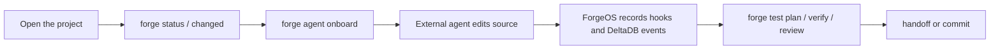

# The Five-Minute ForgeOS Model

ForgeOS is easiest to understand if you keep one priority order in mind:

1. External code agents first.
2. Generated app contracts second.
3. Integrated AI features third.

ForgeOS is not mainly a dashboard and it is not mainly an in-app chatbot. It is a development environment for apps that should be legible, editable, and verifiable by external coding agents such as Codex, Claude Code, Cursor, or another MCP-compatible tool.

## The Core Idea

A normal framework exposes runtime APIs to humans. ForgeOS exposes runtime APIs, architecture maps, policies, frontend bindings, tests, repair commands, and work history to humans and agents.

That means an agent should not begin by guessing from the file tree. It should ask the app for its contract:

```bash
forge status --json
forge changed --json
forge agent onboard --target codex --json
forge dev --once --json
forge inspect all --brief --json
forge agent context --current --json
```

Those commands tell the agent what exists, what changed, what is generated, what is source, which checks matter, and which files are worth reading.

## External Agents vs Integrated AI

External agents are the primary ForgeOS story. They run outside the app: Codex, Claude Code, Cursor, or another coding environment. They edit files, run commands, install hooks, read MCP tools, and use ForgeOS contracts as their map.

Integrated AI is still useful, but it is secondary. ForgeOS supports AI SDK tools, agents, `ctx.ai`, `ctx.agent.run`, and streaming endpoints for apps that need AI inside the product. Those features should not be confused with the external agent workflow.

Use this rule:

| Need | Use |
|------|-----|
| Build or modify the app | External code agent plus ForgeOS context |
| Let users chat inside the app | Integrated AI SDK features |
| Capture what the agent did | Agent Memory hooks and MCP |
| Prove the change is safe | Forge checks, test plan, verify, review |

## The Loop



The browser UI, if one exists, is not where Codex or Claude Code lives. The browser can show what ForgeOS knows: files, timeline, hooks, memory, checks, and handoff state. The coding agent remains the external editor/operator.

For a Studio-style observer, attach the app directory instead of turning the browser into the coding agent:

```bash
forge studio open ../customer-app --preview-port 5174 --target codex --json
forge studio doctor ../customer-app --preview-port 5174 --target codex --json
forge dev --once --json
```

The first command records the observed app, selected external-agent targets, hook setup commands, and preview URL. The second proves whether preview, hooks, generated artifacts, and DeltaDB are trustworthy. The dev snapshot returns `summary.preview.targetAppUrl`, which is the URL the observer should embed for the app being built.

## What To Review First

Generated files are evidence, not the first review surface. Start with authored files:

```bash
forge changed --json
```

Read `reviewFocus.suggestedOrder`. The default order is source, tests, docs, config, operational files, assets, other files, and only then generated artifacts.

Generated artifacts matter because they prove the compiler is deterministic and aligned, but they should usually be reviewed after the source cause is understood.

## Success Criteria

A ForgeOS change is ready when:

- authored source and tests make sense
- generated artifacts are fresh
- `forge check` passes
- the impact-selected tests pass
- `forge verify --standard` passes for normal development
- or `forge verify agent` passes for the normal external-agent loop
- `forge verify --strict` passes before release or a high-risk handoff
- or `forge verify release` passes before publishing
- `forge handoff --json` gives the next agent enough context to continue

## Short Version

ForgeOS is the layer that lets an external coding agent ask:

```text
What app am I editing?
What changed?
What is generated?
What is safe to touch?
What should I test?
What did the previous agent do?
What evidence proves this is ready?
```

That is the product.
