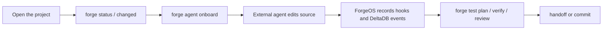

# The Five-Minute ForgeOS Model

ForgeOS is easiest to understand if you keep one priority order in mind:

1. External code agents first.
2. Generated app contracts second.
3. Integrated AI features third.

ForgeOS is not mainly a dashboard and it is not mainly an in-app chatbot. It is a development environment for apps that should be legible, editable, and verifiable by external coding agents such as Codex, Claude Code, Cursor, or another MCP-compatible tool.

## The Core Idea

A normal framework exposes runtime APIs to humans. ForgeOS exposes runtime APIs, architecture maps, policies, frontend bindings, tests, repair commands, and work history to humans and agents.

That means an agent should not begin by guessing from the file tree. It should ask the app for its contract:

```bash
forge status --json
forge changed --json
forge agent onboard --target codex --json
forge dev --once --json
forge inspect all --brief --json
forge agent context --current --json
```

Those commands tell the agent what exists, what changed, what is generated, what is source, which checks matter, and which files are worth reading.

## External Agents vs Integrated AI

External agents are the primary ForgeOS story. They run outside the app: Codex, Claude Code, Cursor, or another coding environment. They edit files, run commands, install hooks, read MCP tools, and use ForgeOS contracts as their map.

Integrated AI is still useful, but it is secondary. ForgeOS supports AI SDK tools, agents, `ctx.ai`, `ctx.agent.run`, and streaming endpoints for apps that need AI inside the product. Those features should not be confused with the external agent workflow.

Use this rule:

| Need | Use |
|------|-----|
| Build or modify the app | External code agent plus ForgeOS context |
| Let users chat inside the app | Integrated AI SDK features |
| Capture what the agent did | Agent Memory hooks and MCP |
| Prove the change is safe | Forge checks, test plan, verify, review |

## The Loop



The browser UI, if one exists, is not where Codex or Claude Code lives. The browser can show what ForgeOS knows: files, timeline, hooks, memory, checks, and handoff state. The coding agent remains the external editor/operator.

For Codex Desktop, hook installation also has a user trust step. ForgeOS can install hook files and write a smoke canary, but it treats the setup as pending until Codex Desktop is approved by the user and a trusted native hook signal appears. In Studio this shows up as `waiting-for-user-trust`, not as a failed app build.

Codex also has a deeper integration surface: `codex app-server`. Forge Studio treats it as optional and diagnostic-first. Hooks remain the universal observer path; app-server adds a richer Codex-specific path for streamed thread/turn/item events, approvals, terminal output, MCP status, and generated version-matched schemas when Studio owns a Codex app-server process. Studio snapshots expose availability under `proofs.codexAppServer` when the target is Codex; add `--probe-codex-server` when the observer should start `codex app-server`, send the documented stdio `initialize`/`initialized` handshake, make safe read-only `model/list` and `account/read` RPCs, and store the sanitized proof under `proofs.codexAppServer.handshake`.

For a Studio-style observer, attach the app directory instead of turning the browser into the coding agent:

```bash
forge studio open ../customer-app --preview-port 5174 --target codex --json
forge studio bridge ../customer-app --preview-port 5174 --target codex --studio-url http://127.0.0.1:3765 --probe-codex-server --json
forge studio doctor ../customer-app --preview-port 5174 --target codex --probe-codex-server --json
forge studio codex-server ../customer-app --json
forge studio codex-server ../customer-app --probe --json
forge dev --once --json
codex app-server generate-ts --out .forge/codex-app-server-schemas
codex app-server generate-json-schema --out .forge/codex-app-server-schemas
```

The first command records the observed app, selected external-agent targets, hook setup commands, and preview URL. It also checks whether dependencies are installed, auto-starts a local target preview when possible, and attempts one Studio bridge ingest. Use `--install` only when you want ForgeOS to run the detected install command for the target app. The bridge command keeps read-only ForgeOS snapshots flowing into the observer runtime, including changed files, hook proofs, DeltaDB status, generated freshness, and preview state. The doctor command proves whether preview, hooks, generated artifacts, and DeltaDB are trustworthy. The dev snapshot returns `summary.preview.targetAppUrl`, which is the URL the observer should embed for the app being built.

When `codex app-server` is available, Studio reports the schema generation commands, the stdio connection command, and a `--probe` mode that performs only the documented initialize handshake. A successful handshake should show as `initialized`, which is stronger than `ready`: `ready` means the CLI surface is available; `initialized` means a Studio-owned app-server process answered the protocol. It does not expose remote WebSocket mode by default: any WebSocket listener should stay on loopback and use token or signed bearer auth before remote access.

The normal local ports are split on purpose: Studio runs at `5173/3765`; the app under construction runs at `5174/3766`.

## What To Review First

Generated files are evidence, not the first review surface. Start with authored files:

```bash
forge changed --json
```

Read `reviewFocus.suggestedOrder`. The default order is source, tests, docs, config, operational files, assets, other files, and only then generated artifacts.

Generated artifacts matter because they prove the compiler is deterministic and aligned, but they should usually be reviewed after the source cause is understood.

## Success Criteria

A ForgeOS change is ready when:

- authored source and tests make sense
- generated artifacts are fresh
- `forge check` passes
- the impact-selected tests pass
- `forge verify --standard` passes for normal development
- or `forge verify agent` passes for the normal external-agent loop
- `forge verify --strict` passes before release or a high-risk handoff
- or `forge verify release` passes before publishing
- `forge handoff --json` gives the next agent enough context to continue

## Short Version

ForgeOS is the layer that lets an external coding agent ask:

```text
What app am I editing?
What changed?
What is generated?
What is safe to touch?
What should I test?
What did the previous agent do?
What evidence proves this is ready?
```

That is the product.
