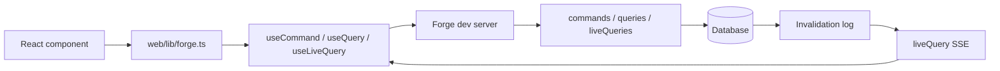
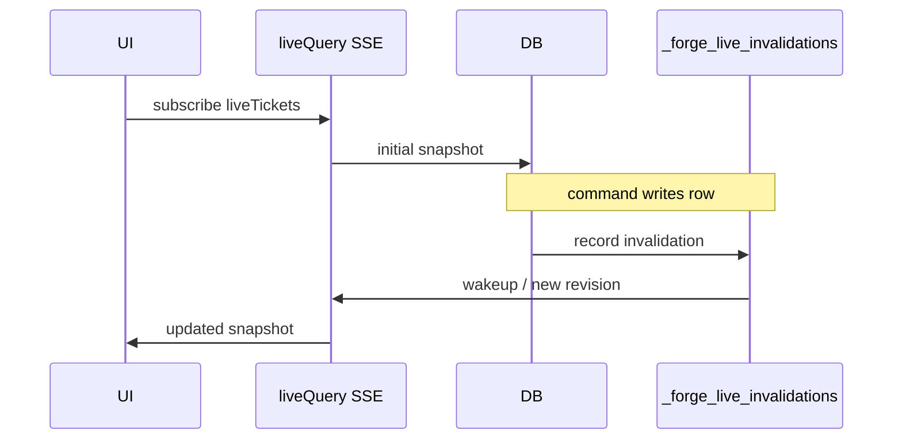

# Frontend

ForgeOS generates a **typed client SDK** and React hooks so web apps call commands, queries, and liveQueries through the same runtime surface as the backend — not ad-hoc fetch URLs.

## Architecture



| Layer | Responsibility |
|-------|----------------|
| React components | UI, forms, lists |
| `web/lib/forge.ts` | Generated bridge to client SDK |
| `ForgeProvider` | API URL, dev auth headers |
| Generated hooks | Typed runtime calls |
| Capability map | Links UI actions to backend entries |

## Client bridge

Templates ship a bridge file such as `web/lib/forge.ts` (or `web/src/lib/forge.ts` for Vite). Import hooks from there — **not** from deep paths under `_generated/`:

```tsx
import { useCommand, useQuery, useLiveQuery, ForgeProvider } from "../lib/forge";
```

After adding commands, queries, or routes:

```bash
forge generate
forge inspect client --json
```

## React hooks

| Hook | Calls | Use for |
|------|-------|---------|
| `useCommand(name)` | `POST /commands/:name` | Writes, form submits |
| `useQuery(name, args)` | `POST /queries/:name` | One-shot reads |
| `useLiveQuery(name, args)` | `GET /live/:name` (SSE) | Live-updating lists |

Example:

```tsx
"use client";

import { useCommand, useLiveQuery } from "../lib/forge";

export function TicketList() {
  const createTicket = useCommand("createTicket");
  const tickets = useLiveQuery("liveTickets", {});

  return (
    <div>
      <button onClick={() => createTicket.mutate({ title: "New ticket" })}>
        Create
      </button>
      <ul>
        {(tickets.data ?? []).map((ticket) => (
          <li key={ticket.id}>{ticket.title}</li>
        ))}
      </ul>
    </div>
  );
}
```

## ForgeProvider and dev auth

Mount `ForgeProvider` once in the app layout. Local development typically uses `devAuth`:

```tsx
import { ForgeProvider } from "../lib/forge";

export function Providers({ children }: { children: React.ReactNode }) {
  return (
    <ForgeProvider
      apiUrl={process.env.NEXT_PUBLIC_FORGE_URL ?? "http://127.0.0.1:3765"}
      devAuth={{
        userId: "dev-user",
        tenantId: "00000000-0000-0000-0000-000000000001",
        role: "owner",
      }}
    >
      {children}
    </ForgeProvider>
  );
}
```

Production uses JWT or OIDC — see [Security and Data](security-and-data.md).

## Anti-patterns

Avoid raw runtime fetches in components:

```tsx
// ❌ bypasses generated client, capability map, and auth helpers
fetch("/commands/createTicket", { method: "POST", body: JSON.stringify({}) });
```

Forge flags many raw fetches in `forge dev --once --json` and `forge inspect frontend --json`.

## Capability map

The **capability map** connects frontend components to backend runtime entries, tables, and policies:

```bash
forge inspect capabilities --json
forge inspect frontend --json
```

It answers:

- Which component calls which command/query/liveQuery?
- Are policy names wired correctly?
- Are there orphan UI actions with no backend entry?

Use `forge do connect-ui --json` when wiring is broken. See [Agent Workflow](agent-workflow.md).

## LiveQuery

LiveQueries are **read-only**, tenant-scoped subscriptions backed by a **durable invalidation log** in production.



Rules:

- Polling and Postgres NOTIFY are **wakeups**, not the source of truth.
- Invalidations are durable rows in `_forge_live_invalidations`.
- Clients may resume with `Last-Event-ID` or `?lastRevision=`.

Debug stale subscriptions:

```bash
forge live status --json
forge live invalidations list --json
forge live debug <subscriptionId> --json
```

See [Troubleshooting — LiveQuery](troubleshooting.md#livequery-stale-or-not-updating).

## Scaffold frontend

When an app has no `web/` directory yet:

```bash
forge make ui --framework vite --dry-run --json
forge make ui --framework vite --yes
```

For AI chat UI backed by dev agent endpoints:

```bash
forge make ai-chat support --dry-run --json
forge make ai-chat support --yes
```

See [Authoring](authoring.md) and [AI](ai.md).

## Local dev loop

```bash
forge dev
forge dev --once --json
```

When `web/` exists, `forge dev` starts **both** the API runtime and the web dev server and prints URLs for each.

Useful flags:

| Flag | Effect |
|------|--------|
| `--api-only` | Backend only |
| `--web-only` | Frontend only |
| `--no-watch` | Disable file watching |
| `--no-worker` | Disable outbox worker |

## Inspection checklist

Before merging frontend changes:

```bash
forge generate
forge inspect frontend --json
forge inspect capabilities --json
forge dev --once --json
forge check --json
```

## Related pages

- [Runtime Model](runtime-model.md) — why commands cannot call network/AI
- [Agent Workflow](agent-workflow.md) — `forge do connect-ui`
- [Templates](templates.md) — minimal-web vs b2b-support-web
- [Security and Data](security-and-data.md) — auth modes and policies
